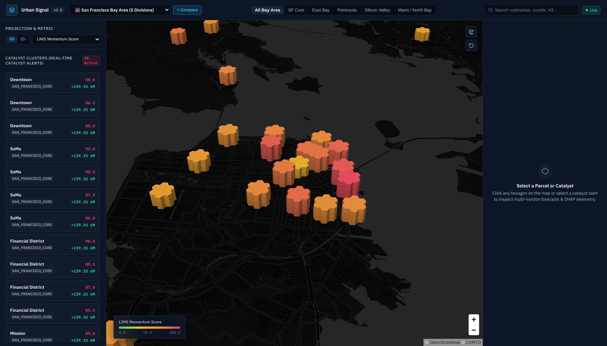
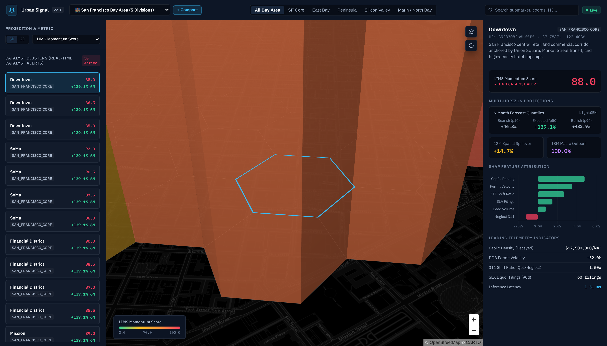
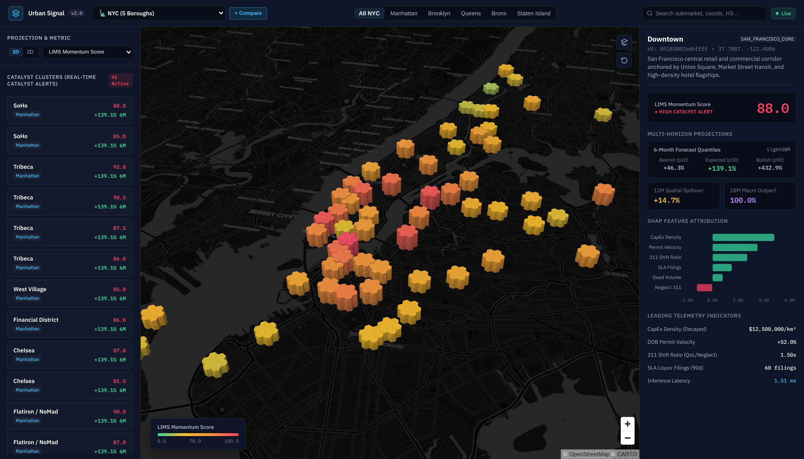
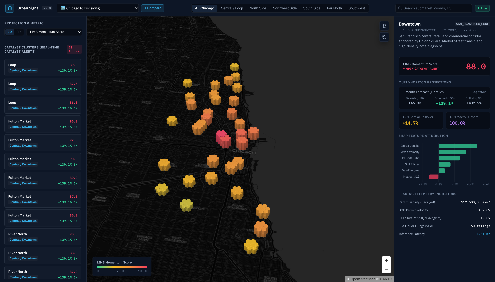
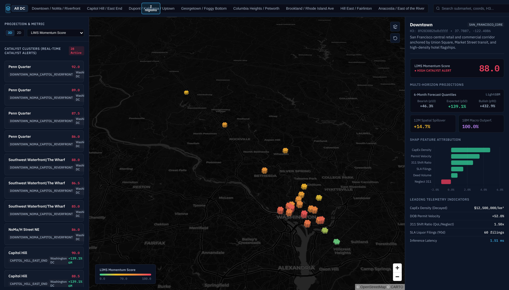
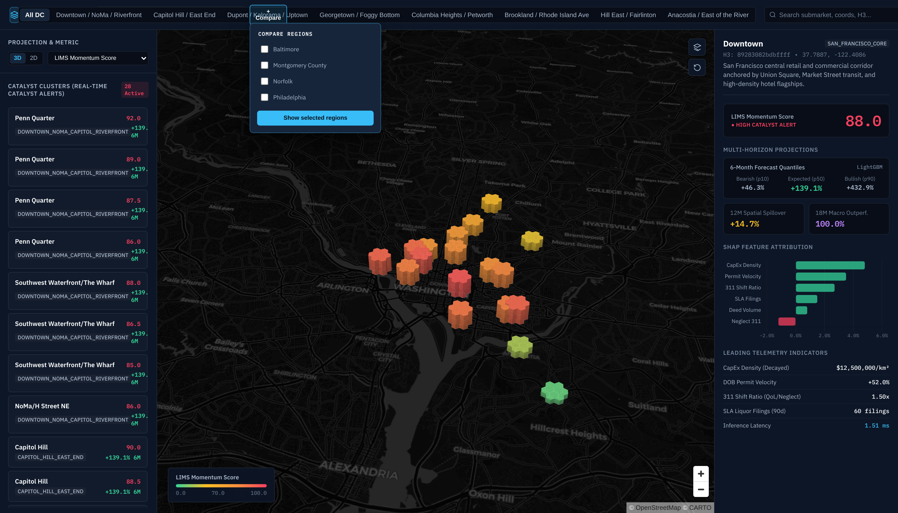

# Urban Signal

> **Real-Time Spatial Intelligence & Commercial Catalyst Forecasting Engine via Multi-City Municipal Ingestion, Event Streaming (Apache Kafka), and Cloud-Native GPU Inference (Kubernetes).**

[](https://www.python.org/)
[](LICENSE)
[](https://fastapi.tiangolo.com)
[](https://kafka.apache.org/)
[](https://h3geo.org/)
[](https://onnxruntime.ai/)
[](https://postgis.net/)

## Dashboard

> **Live Production Dashboard:** [**https://us-dash.harlanljones.com/**](https://us-dash.harlanljones.com/)

| San Francisco Bay Area | Parcel Inspector & SHAP Attribution |
| :---: | :---: |
|  |  |

| New York City (5 Boroughs) | Chicago (6 Divisions) |
| :---: | :---: |
|  |  |

### Comparison mode

The live dashboard supports layered region comparison through the **+ Compare**
control. The populated DC + Montgomery County comparison is shown below.

| DC & Montgomery County Layered Comparison | Comparison Menu Selector |
| :---: | :---: |
|  |  |

The dashboard supports **all seventeen registered metros** — San Francisco Bay Area, New York City, Chicago, Seattle Metro (4 Divisions), Los Angeles Metro (6 Divisions), New Orleans Metro (9 Divisions), Norfolk (5 Divisions), Detroit (6 Divisions), Austin (6 Divisions), Cincinnati (1 Division), Boston (4 Divisions), Baltimore (1 Division), Montgomery County (1 Division), Baton Rouge (1 Division), Denver (1 Division), Philadelphia (8 Divisions), and Washington DC (8 Divisions) — with per-division camera presets, map-click → division resolution, and geolocation-based default-city detection. The **+ Compare** control can layer multiple regions in one viewport; the primary region remains the inspector context while the grid and catalyst feed merge the selected cities.

Explore the live interface at [https://us-dash.harlanljones.com/](https://us-dash.harlanljones.com/) or see [docs/dashboard.md](docs/dashboard.md) for the current dashboard behavior, export path, API surfaces, and screenshot evidence.

---

## 1. System Overview & Architecture

Traditional real estate valuation models rely on lagging transactional comps (deeds, MLS closed transfers). **Urban Signal** ingests leading municipal telemetry—daily building permits (DOB A1/A2/NB / Demolitions), Liquor / Hospitality Licenses, 311 citizen maintenance & quality-of-life complaints, and property deeds / tax rolls across seventeen registered metros—streaming them through Apache Kafka onto an **Uber H3 multi-resolution hexagonal grid** (Res 7, 8, 9) to predict appreciation ($\\Delta \\ln(P)$) **6 to 18 months ahead of public market listings**.

### Registered Cities & Feeds

| Metro | Divisions | Permits | 311 | Licenses | Deeds |
| :--- | :--- | :---: | :---: | :---: | :---: |
| New York City (5 Boroughs) | MANHATTAN, BROOKLYN, QUEENS, BRONX, STATEN_ISLAND | Socrata | Socrata | Socrata | Socrata (ACRIS) |
| Chicago (6 Divisions) | CENTRAL_DOWNTOWN, NORTH_SIDE, FAR_NORTH_SIDE, NORTHWEST_SIDE, SOUTH_SIDE, SOUTHWEST_SIDE | Socrata | Socrata | Socrata | Socrata (Cook County) |
| San Francisco Bay Area (5 Divisions) | SAN_FRANCISCO_CORE, EAST_BAY, PENINSULA, SILICON_VALLEY_SOUTH_BAY, MARIN_NORTH_BAY | Socrata | Socrata | Socrata | Socrata (Assessor) |
| Seattle Metro (4 Divisions) | SEATTLE_CORE, NORTH_KING, EASTSIDE, SOUTH_KING | Socrata | Socrata | Socrata (WA LCB) | ArcGIS (King County parcel sales) |
| Los Angeles Metro (6 Divisions) | CENTRAL_LA, WESTSIDE, SAN_FERNANDO_VALLEY, HARBOR_SOUTH_BAY, SOUTH_LA, EASTSIDE_SGV | Socrata | Socrata (MyLA311) | Socrata | — no open endpoint |
| New Orleans Metro (9 Divisions) | CBD_FRENCH_QUARTER, BYWATER_MARIGNY, UPTOWN_CARROLLTON, MID_CITY, LAKEVIEW_GENTILLY, NEW_ORLEANS_EAST, WEST_BANK_ALGIERS, JEFFERSON_METAIRIE_KENNER, ST_BERNARD_CHALMETTE | Socrata | Socrata | Socrata | Socrata (NORA disposals — no price column) |
| Norfolk (5 Divisions) | DOWNTOWN_WATERFRONT, GHENT_WESTBURG, OCEAN_VIEW, CENTRAL_MILITARY_CIRCLE, SOUTH_NORFOLK_BERKLEY | Socrata | — address-only feed | — no geometry | Socrata (FY sales; rotate ID each July) |
| Detroit (6 Divisions) | DOWNTOWN_MIDTOWN_CORKTOWN, EAST_SIDE_JEFFERSON, WEST_SIDE_GRAND_RIVER, SOUTHWEST_MEXICANTOWN, NORTH_END_HIGHLAND_PARK, EAST_ENGLISH_VILLAGE_MORNINGSIDE | ArcGIS | ArcGIS | ArcGIS | ArcGIS (Assessor sales; typo-year sentinel tolerated) |
| Austin (6 Divisions) | DOWNTOWN_CAPITOL, EAST_AUSTIN_MUELLER, SOUTH_AUSTIN_SOCO, NORTH_AUSTIN_DOMAIN, WEST_AUSTIN_HILLS, PFLUGERVILLE_ROUND_ROCK_EDGE | Socrata | Socrata | — TABC un-geocoded | — county shell |
| Cincinnati (1 Division) | CINCINNATI_CORE | [Socrata](docs/research/socrata-sweep.md#cincinnati) | [Socrata](docs/research/socrata-sweep.md#cincinnati) | [Socrata](docs/research/socrata-sweep.md#cincinnati) | — no verified sales feed |
| Boston (4 Divisions) | BOSTON_CORE, CAMBRIDGE_SOMERVILLE, INNER_NORTH, INNER_SOUTH | [CKAN](docs/research/non-socrata-platforms.md#boston--ckan--permits-and-311-strong-no-sales) | [CKAN](docs/research/non-socrata-platforms.md#boston--ckan--permits-and-311-strong-no-sales) | [CKAN](docs/research/non-socrata-platforms.md#boston--ckan--permits-and-311-strong-no-sales) | — no verified sales feed |
| Baltimore (1 Division) | BALTIMORE_CORE | ArcGIS | ArcGIS (year-sliced) | ArcGIS (notifications-grade) | — no verified sales feed |
| Montgomery County, MD (1 Division) | MONTGOMERY_CORE | [Socrata](docs/research/socrata-sweep.md#montgomery-county-md--data-montgomerycountymdgov--2-solid--1-weak) | — MC311 excluded: no coordinates | [Socrata](docs/research/socrata-sweep.md#montgomery-county-md--data-montgomerycountymdgov--2-solid--1-weak) | — no verified sales feed |
| Baton Rouge / EBR (1 Division) | BATON_ROUGE_CORE | [Socrata](docs/research/socrata-sweep.md#baton-rouge-east-baton-rouge-parish-la-data-brlagov-34) | [Socrata](docs/research/socrata-sweep.md#baton-rouge-east-baton-rouge-parish-la-data-brlagov-34) | [Socrata snapshot](docs/research/socrata-sweep.md#baton-rouge-east-baton-rouge-parish-la-data-brlagov-34) | — no market sales feed |
| Denver (1 Division) | DENVER_CORE | [ArcGIS](docs/research/non-socrata-platforms.md#denver--arcgis-hub--three-usable-feeds-licenses-weak-sales-not-geocoded) | [ArcGIS](docs/research/non-socrata-platforms.md#denver--arcgis-hub--three-usable-feeds-licenses-weak-sales-not-geocoded) | — licenses lack issue dates | — sales ungeocoded; $0 transfer quirk documented |
| Philadelphia (8 Divisions) | CENTER_CITY_RITTENHOUSE, OLD_CITY_NORTHERN_LIBERTIES, SOUTH_PHILLY_PASSYUNK, WEST_PHILLY_UNIVERSITY_CITY, NORTH_PHILLY_TEMPLE, NORTHEAST_ROOSEVELT_BLVD, GERMANTOWN_MT_AIRY, RIVER_WARDS_KENSINGTON | CARTO | CARTO | CARTO | CARTO (RTT summary; mortgages → amount 0.0) |
| Washington DC (8 Divisions) | DOWNTOWN_NOMA_CAPITOL_RIVERFRONT, CAPITOL_HILL_EAST_END, DUPONT_KALORAMA_UPTOWN, GEORGETOWN_FOGGY_BOTTOM, COLUMBIA_HEIGHTS_PETWORTH, BROOKLAND_RHODE_ISLAND_AVE, HILL_EAST_FAIRLINTON, ANACOSTIA_EAST_OF_THE_RIVER | ArcGIS (year-sliced) | ArcGIS (year-sliced) | ArcGIS (non-spatial) | ArcGIS CAMA (non-spatial; parcel-join future work) |

Partial registrations are deliberate: cities register only feeds that exist, and `get_dataset` raises a readable error for the rest (`apps/api/src/spatial/city_registry.py`).

### Architecture Flow

```mermaid
flowchart TD

subgraph group_ingestion["Municipal Ingestion"]
  node_city_registry["City registry<br/>city boundary<br/>[city_registry.py]"]
  node_municipal_sources(("Socrata &amp; ArcGIS<br/>external data APIs<br/>[socrata_client.py]"))
  node_producers["Municipal producers<br/>ingestion workers<br/>[base_producer.py]"]
  node_avro_contracts["Avro contracts<br/>event schemas"]
end

subgraph group_streaming["Kafka Pipeline"]
  node_kafka["Kafka topics<br/>event backbone<br/>[kafka-topics.yaml]"]
  node_spatial_worker["Spatial enrichment<br/>Kafka worker"]
  node_feature_worker["Feature aggregation<br/>Kafka worker"]
  node_postgis_worker["PostGIS sync worker<br/>Kafka worker<br/>[postgis_worker.py]"]
  node_keda{{"KEDA autoscaling<br/>consumer scaling"}}
end

subgraph group_spatial["Spatial Features"]
  node_h3_context["H3 &amp; submarkets<br/>spatial context<br/>[graph_builder.py]"]
  node_feature_pipeline["Feature pipeline<br/>feature engineering<br/>[pipeline.py]"]
end

subgraph group_ml["Training &amp; Storage"]
  node_postgis[("PostGIS<br/>spatial system of record<br/>[postgis_sync.py]")]
  node_object_store[("MinIO/S3 artifacts<br/>feature and model storage")]
  node_retraining["Retraining job<br/>model orchestration<br/>[retraining_job.py]"]
  node_horizon_models["Horizon models<br/>forecast models<br/>[trainer.py]"]
  node_onnx_export["ONNX export<br/>model packaging<br/>[export_onnx.py]"]
end

subgraph group_delivery["Serving &amp; Edge"]
  node_fastapi["FastAPI service<br/>prediction API<br/>[app.py]"]
  node_snapshots["Snapshot builder<br/>edge export"]
  node_cloudflare_worker{{"Cloudflare Worker<br/>edge API<br/>[index.ts]"}}
end

node_city_registry -->|"supported feeds"| node_producers
node_municipal_sources -->|"city records"| node_producers
node_producers -->|"typed events"| node_avro_contracts
node_avro_contracts -->|"raw topics"| node_kafka
node_kafka -->|"raw events"| node_spatial_worker
node_spatial_worker -->|"H3 assignment"| node_h3_context
node_spatial_worker -->|"enriched events"| node_kafka
node_kafka -->|"enriched stream"| node_feature_worker
node_h3_context -->|"cell context"| node_feature_pipeline
node_feature_worker -->|"event windows"| node_feature_pipeline
node_feature_pipeline -->|"features and alerts"| node_kafka
node_kafka -->|"raw and feature topics"| node_postgis_worker
node_postgis_worker -->|"durable sync"| node_postgis
node_keda -.->|"scales"| node_spatial_worker
node_keda -.->|"scales"| node_feature_worker
node_postgis -->|"historical data"| node_retraining
node_object_store -->|"feature partitions"| node_retraining
node_retraining -->|"validated training"| node_horizon_models
node_horizon_models -->|"trained models"| node_onnx_export
node_onnx_export -->|"ONNX artifacts"| node_object_store
node_object_store -->|"model artifacts"| node_fastapi
node_postgis -->|"grid and catalog queries"| node_fastapi
node_postgis -->|"queryable data"| node_snapshots
node_snapshots -->|"precomputed snapshots"| node_object_store
node_object_store -->|"edge snapshots"| node_cloudflare_worker

click node_city_registry "https://github.com/harlanljones/urban-signal/blob/main/apps/api/src/spatial/city_registry.py"
click node_municipal_sources "https://github.com/harlanljones/urban-signal/blob/main/apps/api/src/producers/socrata_client.py"
click node_producers "https://github.com/harlanljones/urban-signal/blob/main/apps/api/src/producers/base_producer.py"
click node_kafka "https://github.com/harlanljones/urban-signal/blob/main/deploy/k8s/kafka/kafka-topics.yaml"
click node_spatial_worker "https://github.com/harlanljones/urban-signal/blob/main/apps/api/src/consumers/spatial_enrichment_worker.py"
click node_feature_worker "https://github.com/harlanljones/urban-signal/blob/main/apps/api/src/consumers/feature_aggregation_worker.py"
click node_postgis_worker "https://github.com/harlanljones/urban-signal/blob/main/apps/api/src/consumers/postgis_worker.py"
click node_keda "https://github.com/harlanljones/urban-signal/blob/main/deploy/k8s/consumers/keda-scaledobject.yaml"
click node_h3_context "https://github.com/harlanljones/urban-signal/blob/main/apps/api/src/spatial/graph_builder.py"
click node_feature_pipeline "https://github.com/harlanljones/urban-signal/blob/main/apps/api/src/features/pipeline.py"
click node_postgis "https://github.com/harlanljones/urban-signal/blob/main/apps/api/src/storage/postgis_sync.py"
click node_retraining "https://github.com/harlanljones/urban-signal/blob/main/apps/api/src/models/retraining_job.py"
click node_horizon_models "https://github.com/harlanljones/urban-signal/blob/main/apps/api/src/models/trainer.py"
click node_onnx_export "https://github.com/harlanljones/urban-signal/blob/main/apps/api/src/models/export_onnx.py"
click node_fastapi "https://github.com/harlanljones/urban-signal/blob/main/apps/api/src/serving/app.py"
click node_snapshots "https://github.com/harlanljones/urban-signal/blob/main/apps/api/src/export/snapshot_builder.py"
click node_cloudflare_worker "https://github.com/harlanljones/urban-signal/blob/main/apps/dashboard/src/index.ts"

classDef toneNeutral fill:#f8fafc,stroke:#334155,stroke-width:1.5px,color:#0f172a
classDef toneBlue fill:#dbeafe,stroke:#2563eb,stroke-width:1.5px,color:#172554
classDef toneAmber fill:#fef3c7,stroke:#d97706,stroke-width:1.5px,color:#78350f
classDef toneMint fill:#dcfce7,stroke:#16a34a,stroke-width:1.5px,color:#14532d
classDef toneRose fill:#ffe4e6,stroke:#e11d48,stroke-width:1.5px,color:#881337
classDef toneIndigo fill:#e0e7ff,stroke:#4f46e5,stroke-width:1.5px,color:#312e81
classDef toneTeal fill:#ccfbf1,stroke:#0f766e,stroke-width:1.5px,color:#134e4a
class node_city_registry,node_municipal_sources,node_producers,node_avro_contracts toneBlue
class node_kafka,node_spatial_worker,node_feature_worker,node_postgis_worker,node_keda toneAmber
class node_h3_context,node_feature_pipeline toneMint
class node_postgis,node_object_store,node_retraining,node_horizon_models,node_onnx_export toneRose
class node_fastapi,node_snapshots,node_cloudflare_worker toneIndigo
```



```
+---------------------------------------------------------------------------------------------------+
|              MUNICIPAL OPEN DATA INGESTION (Socrata SODA REST + ArcGIS FeatureServer)             |
|         DOB Permits (A1/A2/NB) | 311 Complaints | SLA Liquor Licenses | ACRIS Property Deeds      |
+-------------------------------------------------+-------------------------------------------------+
                                                  | Ingest & Deduplicate
                                                  v
+---------------------------------------------------------------------------------------------------+
|                           KAFKA STREAMING & APICURIO SCHEMA REGISTRY                              |
|   raw.municipal.permits | raw.municipal.311 | raw.municipal.sla | raw.municipal.deeds | dlq.*     |
+-------------------------------------------------+-------------------------------------------------+
                                                  | Consume & Enrich (KEDA Autoscaled)
                                                  v
+---------------------------------------------------------------------------------------------------+
|                       STREAM CONSUMERS & SPATIO-TEMPORAL ENRICHMENT                               |
|   • H3 Spatial Normalization (Res 7 Macro, Res 8 Submarket, Res 9 Micro)                          |
|   • Time-Decayed CapEx Calculator (180-day half-life exponential decay)                           |
|   • 311 Complaint Shift Dynamics Ratio ((QoL + eps) / (Neglect + eps))                            |
|   • Leading Indicator Momentum Score (LIMS) [0..100]                                              |
|   • Enriched Stream Emitter (enriched.spatial.h3) & Alert Trigger (alerts.catalyst)               |
+------------------------+--------------------------------------------------+-----------------------+
                         |                                                  |
                         v                                                  v
+--------------------------------------------------+     +------------------------------------------+
| DATA & ANALYTICAL STORAGE                        |     | REAL-TIME INFERENCE & SERVING (FastAPI)  |
| • PostGIS 16 (GiST spatial & BRIN time indices)  |     | • Multi-Horizon ONNX Engine (<5ms CUDA)  |
| • DuckDB (Out-of-Core Aggregations)              |     | • 6m LightGBM Quantile Pinball (p10/50/90|
| • Polars (High-Performance DataFrames)           |     | • 12m ST-GNN (HexGCN + GRU Recurrence)   |
| • MinIO S3 (Parquet Features & Model Registry)   |     | • 18m DCN-v2 (Cross Network Ensemble)    |
+--------------------------------------------------+     | • TreeSHAP Catalyst Driver Attributions  |
                                                         | • Hardened MapLibre GL Dashboard         |
                                                         | • Webhook Alert Dispatcher & Prometheus  |
                                                         +------------------------------------------+
```

---

## 2. Mathematical Formulations

### Exponential Time-Decayed CapEx Density
$$\\text{CapEx Density}_{\\text{cell } h, t} = \\frac{1}{\\text{Area}(h)} \\sum_{i \\in \\mathcal{P}_{h, t}} \\text{Cost}_i \\cdot e^{-\\lambda (t - t_i)}, \\quad \\lambda = \\frac{\\ln(2)}{180\\text{ days}}$$
Where $\\mathcal{P}_{h, t}$ represents structural building alteration permits in cell $h$ over lookback window $t$, and $\\text{Area}(h)$ is the geodesic area in $\\text{km}^2$.

### 311 Shift Dynamics Ratio
Measures transition from structural landlord disinvestment complaints ($C_{\\text{neglect}}$: heat, water outages, pests) to commercial footfall / quality-of-life complaints ($C_{\\text{QoL}}$: noise, sidewalk sheds, dining):
$$\\Delta R_{311} = \\frac{C_{\\text{QoL}} + \\varepsilon}{C_{\\text{neglect}} + \\varepsilon}$$

### Leading Indicator Momentum Score (LIMS)
$$\\text{LIMS}_h = \\alpha \\cdot \\mathcal{Z}(\\text{CapEx}_h) + \\beta \\cdot \\mathcal{Z}(\\text{PermitVelocity}_h) + \\gamma \\cdot \\mathcal{Z}(\\Delta R_{311, h}) + \\delta \\cdot \\mathcal{Z}(\\text{Lic}_{\\text{SLA}, h})$$
- Default weights: $\\alpha=0.35, \\beta=0.25, \\gamma=0.20, \\delta=0.20$
- Normalized via logistic sigmoid projection to $[0.0, 100.0]$. Scores $\\ge 85.0$ emit real-time Catalyst Alerts to `alerts.catalyst`.

---

## 3. Multi-Horizon Machine Learning Architecture

| Horizon | Objective Function | Architecture Tier | Primary Output |
| :--- | :--- | :--- | :--- |
| **6-Month Micro** | Pinball Loss ($\\alpha = 0.1, 0.5, 0.9$) | `LightGBMQuantilePredictor` | Immediate parcel price/sqft inflection intervals |
| **12-Month Neighborhood** | Huber Loss / MSE | `SpatioTemporalGNN` (`HexGCNLayer` + `nn.GRUCell`) | Spatial spillover & corridor diffusion |
| **18-Month Macro** | Binary Cross-Entropy | `MultiScaleDCNv2` (`CrossNetworkV2` + Deep MLP) | Probability of $>15\\%$ structural outperformance |

### Spatial-Temporal Leakage Prevention Protocol
Standard random K-Fold CV creates severe spatial-temporal data leakage (training on building A while evaluating adjacent building B in the same month). Urban Signal enforces a **Rolling Walk-Forward Temporal Split** coupled with **H3-7 Spatial Cluster Block Holdouts** (entire H3-7 parent hexagons held out from training) to guarantee model generalization across unseen urban markets.

### Interpretability & Explainability
Parcel predictions incorporate **TreeSHAP** (`CatalystExplainer`) decompositions, mapping the relative percentage contributions of CapEx density, permit velocity, 311 shift ratio, and SLA license filings directly in the API response and geospatial dashboard.

---

## 4. Repository Structure

```
urban-signal/
├── apps/
│   ├── api/                                # FastAPI + Kafka + PostGIS + H3 ML core service
│   │   ├── src/
│   │   │   ├── config.py                   # Central Pydantic Settings & environment config
│   │   │   ├── schemas/                    # Pydantic models & Avro binary schema contracts (.avsc)
│   │   │   ├── spatial/                    # Uber H3 indexing, per-city modules, city registry, GIS utilities
│   │   │   ├── features/                   # Time-decay, 311 shift dynamics, LIMS calculator, DuckDB
│   │   │   ├── producers/                  # Socrata/ArcGIS clients, per-feed producers, scheduler
│   │   │   ├── consumers/                  # Base Kafka consumer, H3 enrichment, aggregation, PostGIS
│   │   │   ├── storage/                    # PostGIS synchronization engine & table schemas
│   │   │   ├── models/                     # LightGBM, ST-GNN, DCN-v2, Walk-Forward CV, ONNX exporter
│   │   │   ├── serving/                    # FastAPI app, router, inference engine, dashboard, webhooks
│   │   │   └── export/                     # Static edge snapshot builder & JSON exporter
│   │   ├── tests/
│   │   │   ├── conftest.py                 # Pytest fixtures & sample geospatial payloads
│   │   │   ├── unit/                       # Unit suites incl. interlock invariant gate (20 tests)
│   │   │   └── e2e/                        # End-to-end integration test suite
│   │   └── pyproject.toml                  # Python packaging and dependency specifications
│   ├── dashboard/                          # Cloudflare Worker (@urban-signal/dashboard): static UI & KV snapshot edge
│   │   ├── public/                         # Synchronized dashboard HTML asset
│   │   ├── src/                            # Edge router and KV snapshot proxy
│   │   └── wrangler.jsonc                  # Cloudflare Worker configuration
│   ├── product/                            # Product landing and interactive architecture learning site
│   │   ├── public/                         # Static assets, llms.txt, facts.json
│   │   └── src/                            # Interactive client scripts
│   └── webhook/                            # Real-time webhook receiver worker (hooks.harlanljones.com)
├── packages/
│   └── typescript-config/                  # Shared TypeScript configuration
├── deploy/
│   ├── docker/
│   │   └── docker-compose.dev.yml          # Local Kafka (KRaft), Schema Registry, PostGIS, MinIO, AKHQ
│   └── k8s/
│       ├── namespaces.yaml                 # 5 isolated cluster namespaces
│       ├── kafka/
│       │   ├── strimzi-cluster.yaml        # Strimzi 3-broker cluster & NVMe storage
│       │   └── kafka-topics.yaml           # KafkaTopic manifests with retention policies
│       ├── storage/
│       │   └── postgis-statefulset.yaml    # PostGIS 16 + GiST/BRIN indexing PVCs
│       ├── consumers/
│       │   └── keda-scaledobject.yaml      # KEDA autoscaling spatial consumer pods (1 -> 8)
│       └── inference/
│           └── inference-deployment.yaml   # FastAPI + ONNX Runtime (CUDA GPU)
├── models_storage/                         # Serialized ONNX model artifacts (DCN-v2, ST-GNN)
├── docs/
│   ├── adr/                                # Architecture decision records (0001 Agent Interlock)
│   ├── agents/                             # Agent-facing conventions: spine manifest, stream rules
│   ├── research/                           # City expansion candidate surveys & data source sweeps
│   └── screenshots/                        # Dashboard captures from live production
├── scripts/
│   ├── export_dashboard.py                 # Exports dashboard HTML to Worker public asset
│   ├── interlock_gap.py                    # Interlock-gap metric over a git diff range
│   └── feed_staleness_probe.py             # Registered feed freshness probe
├── .streams/                               # Agent stream logs & dispatch log (see AGENTS.md)
├── turbo.json                              # Turborepo task pipeline configuration
├── package.json                            # Bun workspaces and root package scripts
├── LICENSE                                 # Apache 2.0 Open Source License
└── urban_signal_prospectus_k8s_kafka.md    # Full technical design prospectus
```

---

## 5. Configuration & Environment Variables

All settings are managed via `apps/api/src/config.py` using `pydantic-settings` and can be overridden via `.env` or container environment variables:

See [`docs/environment.md`](docs/environment.md) for precedence, local Compose,
Kubernetes Secrets, and production credential requirements. Start from
[`.env.example`](.env.example); replace every `CHANGE_ME` value before using it.

| Variable | Default Value | Description |
| :--- | :--- | :--- |
| `APP_ENV` | `development` | Environment mode (`development`, `staging`, `production`) |
| `LOG_LEVEL` | `INFO` | Logging verbosity (`DEBUG`, `INFO`, `WARNING`, `ERROR`) |
| `SERVICE_NAME` | `urban-signal-predictor` | Service identifier |
| `KAFKA_BOOTSTRAP_SERVERS` | `localhost:9092` | Kafka broker endpoints (`kafka-cluster-kafka-bootstrap.kafka-streaming:9092` in K8s) |
| `KAFKA_SCHEMA_REGISTRY_URL` | `http://localhost:8081` | Schema Registry endpoint |
| `KAFKA_SECURITY_PROTOCOL` | `PLAINTEXT` | Security protocol (`PLAINTEXT`, `SASL_PLAINTEXT`, `SSL`) |
| `POSTGRES_HOST` / `PORT` / `DB` | `localhost` / `5432` / `urbansignal` | PostGIS database connection parameters |
| `POSTGRES_USER` / `PASSWORD` | `postgres` / `postgres` | PostGIS authentication credentials |
| `MINIO_ENDPOINT` | `localhost:9000` | MinIO S3 object storage endpoint |
| `MINIO_ACCESS_KEY` / `SECRET_KEY` | `minioadmin` / `minioadmin` | MinIO S3 credentials |
| `MINIO_BUCKET_FEATURES` | `urban-signal-features` | S3 bucket for feature partitions & model registry |
| `SOCRATA_APP_TOKEN` | `None` | Optional Socrata API token for elevated rate limits |
| `H3_RES_MACRO` / `NEIGHBORHOOD` / `MICRO` | `7` / `8` / `9` | Multi-resolution Uber H3 grid levels |
| `CAPEX_HALFLIFE_DAYS` | `180.0` | Half-life parameter ($\\lambda = \\ln(2)/180$) for CapEx time decay |
| `LIMS_THRESHOLD` | `85.0` | Minimum LIMS score triggering a Catalyst Alert |
| `ONNX_MODEL_DIR` | `./models_storage` | Local path to exported ONNX model files |
| `ONNX_EXECUTION_PROVIDER` | `CPUExecutionProvider` | ONNX Provider (`CPUExecutionProvider`; use CUDA explicitly on GPU hosts) |
| `WEBHOOK_ALERT_URLS` | `[]` | JSON array of URLs for real-time catalyst alert dispatching |

### GitHub Actions deployment and monitoring

The repository ships two workflows under `.github/workflows/`:

- `batch-push-deploy` validates pull requests, deploys the edge worker and refreshed
  Workers KV snapshot on pushes to `main`, and runs the batch refresh nightly.
- `feed-staleness-monitor` validates pull requests, probes every registered feed weekly,
  and supports manual city, threshold, and dry-run inputs.

Configure these repository secrets before enabling deployment or webhook delivery:

- `CLOUDFLARE_API_TOKEN`
- `CLOUDFLARE_ACCOUNT_ID`
- `WEBHOOK_ALERT_URLS` as a JSON array, for example `["https://staging.example/hooks/feed-staleness"]`

---

## 6. Quickstart & Local Development

### Prerequisites
- Python 3.11+ / 3.12 (`uv` or `pip`)
- Docker & Docker Compose
- NVIDIA GPU (Optional: CUDA Execution Provider accelerates inference to $<5\\text{ms}$)

### Setup & Installation
```bash
# 1. Clone repository & enter directory
git clone https://github.com/harlanljones/urban-signal.git
cd urban-signal

# 2. Set up Python API workspace
cd apps/api
uv venv --python 3.12
source .venv/bin/activate
uv pip install -e ".[dev]"
cd ../..

# 3. Launch local Kafka (KRaft), Schema Registry, PostGIS, MinIO & AKHQ
docker compose -f deploy/docker/docker-compose.dev.yml up -d
```

### Endpoints & Dashboards
- **Live Production Dashboard:** [https://us-dash.harlanljones.com/](https://us-dash.harlanljones.com/)
- **FastAPI Interactive API Docs:** [http://localhost:8000/docs](http://localhost:8000/docs)
- **Local Geospatial Catalyst Dashboard:** [http://localhost:8000/dashboard](http://localhost:8000/dashboard)
- **AKHQ Kafka Visualizer:** [http://localhost:8080](http://localhost:8080)
- **Schema Registry:** [http://localhost:8081](http://localhost:8081)
- **MinIO S3 Console:** [http://localhost:9001](http://localhost:9001) (`minioadmin` / `minioadmin`)

---

### Running Ingestion Producers & Poller Scheduler

You can stream data using individual one-off producer runs or the continuous polling scheduler. Every producer accepts `--city` with any registered alias (e.g. `seattle`, `king county`, `la`):

```bash
# Option A: Continuous Municipal Ingestion Scheduler (with deduplication & DLQ).
# Jobs are city-namespaced: permits, 311, sla, deeds (NYC) + <feed>_<suffix> per other city.
python -m src.producers.scheduler --jobs permits sla deeds permits_seattle deeds_seattle permits_la sla_la --interval 60 --limit 500

# Option B: Run individual one-off streams
python -m src.producers.dob_permits_producer --city nyc --limit 2000
python -m src.producers.complaints_311_producer --city chicago --limit 2000
python -m src.producers.sla_licenses_producer --city san_francisco --limit 1000
python -m src.producers.deeds_acris_producer --city seattle --limit 1000
```

---

### Running Stream Consumers & Background Workers

```bash
# 1. Spatial Enrichment Worker (H3 Res 7/8/9 join & DuckDB out-of-core sink)
python -m src.consumers.spatial_enrichment_worker

# 2. Feature Aggregator Worker (Publishes to enriched.spatial.h3 & alerts.catalyst)
python -m src.consumers.feature_aggregation_worker

# 3. PostGIS Spatial Sync Worker (Persists raw streams & features with GiST/BRIN indices)
python -m src.consumers.postgis_worker
```

---

### Model Retraining Pipeline

Execute the automated walk-forward cross-validation, ONNX export, and MinIO model artifact upload:

```bash
python -m src.models.retraining_job \
  --version v2.1 \
  --epochs-gnn 15 \
  --epochs-dcn 15 \
  --n-estimators-lgbm 100
```

---

### Launching the Real-Time Serving API & Dashboard

```bash
# Start FastAPI service with automatic hot-reloading
uvicorn src.serving.app:app --host 0.0.0.0 --port 8000 --reload
```

---

## 7. Cloud-Native Kubernetes (k3s / RKE2) Deployment

The platform is engineered for on-premises enterprise Kubernetes clusters using Strimzi and KEDA:

```bash
# 1. Provision isolated namespaces
kubectl apply -f deploy/k8s/namespaces.yaml

# 2. Deploy Strimzi Kafka cluster & topics
kubectl apply -f deploy/k8s/kafka/strimzi-cluster.yaml
kubectl wait --for=condition=Ready kafka/kafka-cluster -n kafka-streaming --timeout=300s
kubectl apply -f deploy/k8s/kafka/kafka-topics.yaml

# 3. Create database credentials & deploy PostGIS StatefulSet
kubectl create secret generic postgis-credentials \
  --from-literal=password="$POSTGRES_PASSWORD" \
  -n data-storage \
  --dry-run=client -o yaml | kubectl apply -f -
kubectl apply -f deploy/k8s/storage/postgis-statefulset.yaml

# 4. Deploy KEDA autoscaling spatial consumer workers
kubectl apply -f deploy/k8s/consumers/keda-scaledobject.yaml

# 5. Deploy ONNX GPU inference service
kubectl apply -f deploy/k8s/inference/inference-deployment.yaml

# 6. Check cluster status
kubectl get pods -A -l "app in (urban-signal-inference-service, h3-enrichment-worker, postgis)"
```

---

## 8. API Reference

### Health & Probe Endpoints
- `GET /health` — General health check
- `GET /ready` — Kubernetes readiness probe
- `GET /live` — Kubernetes liveness probe

```json
{
  "status": "healthy",
  "service": "urban-signal-predictor",
  "version": "2.0.0",
  "environment": "development"
}
```

### Prometheus Metrics
`GET /metrics`
Exposes real-time Prometheus telemetry including `prediction_requests_total`, `catalyst_alerts_emitted_total`, and `inference_latency_seconds`.

### Interactive Geospatial Dashboard
`GET /dashboard` or `GET /` (with `Accept: text/html`)
Serves the hardened, high-performance **MapLibre GL** web visualizer featuring single-region selection and multi-region comparison across all seventeen registered metros (San Francisco, NYC, Chicago, Seattle, Los Angeles, New Orleans, Norfolk, Detroit, Austin, Cincinnati, Boston, Baltimore, Montgomery County, Baton Rouge, Denver, Philadelphia, Washington DC), submarket filtering, H3 hexagon inspection, LIMS heatmaps, and SHAP attribution waterfall charts.

The same UI is mirrored as a static asset on the Cloudflare Worker (`apps/dashboard/`), deployed live to [https://us-dash.harlanljones.com/](https://us-dash.harlanljones.com/), where `/api/v1/*` is answered from a precomputed Workers KV snapshot (built by `src/export/snapshot_builder.py`). The FastAPI service and the edge snapshot both serve all seventeen registered metros.

---

### Single Real-Time Prediction
`POST /api/v1/predict`
```json
{
  "latitude": 37.7749,
  "longitude": -122.4194,
  "resolution": 9,
  "include_shap": true
}
```
**Response ($p99 < 10\\text{ms}$):**
```json
{
  "h3_index": "8928308280fffff",
  "resolution": 9,
  "centroid_lat": 37.7749,
  "centroid_lng": -122.4194,
  "lims_score": 88.45,
  "delta_6m_p10": 0.0312,
  "delta_6m_p50": 0.0845,
  "delta_6m_p90": 0.1420,
  "delta_12m_spillover": 0.1650,
  "prob_18m_macro_outperformance": 0.8920,
  "is_catalyst": true,
  "shap_attributions": {
    "capex_density_decayed": 38.5,
    "permit_velocity": 24.2,
    "shift_ratio_311": 19.8,
    "sla_new_filings_90d": 17.5
  },
  "inference_latency_ms": 3.42
}
```

---

### Batch Multi-Cell Prediction
`POST /api/v1/predict/batch`
```json
[
  {"latitude": 37.7749, "longitude": -122.4194, "resolution": 9, "include_shap": true},
  {"latitude": 40.7233, "longitude": -74.0030, "resolution": 9, "include_shap": true}
]
```

---

### City & Division Catalogs
`GET /api/v1/cities`
Returns the catalog of all registered metropolitan regions with centers, bounding boxes, divisions, and available feeds.

`GET /api/v1/spatial/divisions?city_id=seattle`
Returns the structured division/borough catalog for a metro, including per-division bounding boxes and submarket rosters.

---

### Submarket Catalog Discovery
`GET /api/v1/submarkets?city_id=san_francisco&borough=SAN_FRANCISCO_CORE`
Returns the catalog of commercial/residential submarkets across divisions with centroid coordinates, camera presets, and baseline momentum profiles.

---

### Submarket Prediction
`GET /api/v1/predictions/submarket/SoHo?city_id=nyc&include_shap=true`
Multi-horizon forecast aggregated to a named submarket, with SHAP driver attributions.

---

### Dashboard Metrics Rollup
`GET /api/v1/dashboard/metrics?city_id=chicago`
Aggregated summary statistics powering the dashboard header cards.

---

### Active Catalyst Clusters
`GET /api/v1/catalysts?city_id=san_francisco&min_lims=85.0&resolution=9&limit=50`
Retrieves top high-momentum submarkets and parcels currently triggering catalyst alerts ($\\text{LIMS} \\ge 85.0$).

---

### GeoJSON Hex Grid Export
`GET /api/v1/grid?city_id=san_francisco&resolution=9&k_ring=1&include_shap=true`
Returns a GeoJSON `FeatureCollection` of H3 hexagonal polygons with embedded LIMS scores, multi-horizon price appreciation forecasts, and SHAP drivers.

---

### Hexagon Spatial Feature Inspection
`GET /api/v1/hex/{h3_index}/features?resolution=9`
Returns raw spatio-temporal feature attributes, centroid coordinates, and GeoJSON polygon boundary for an individual H3 cell.

---

## 9. Testing & Quality Assurance

Run the automated test suite with pytest from the API workspace:
```bash
cd apps/api && pytest tests/ -v
```

The test suite includes **222 automated unit and end-to-end integration tests** across 16 unit suites plus one end-to-end pipeline suite, covering:
- **Spatial Indexing & Submarket Registries**: Multi-city coverage across NYC (5 Boroughs), Chicago (6 Divisions), San Francisco Bay Area, Seattle Metro, and Los Angeles.
- **Stream Processing & Avro Serialization**: Schema enforcement and dead-letter queue routing.
- **Out-of-core Feature Engineering**: DuckDB spatio-temporal joins and exponential CapEx decay.
- **Model Inference & Validation**: LightGBM Quantile Pinball loss, ST-GNN ONNX, DCN-v2 ONNX, and TreeSHAP explainability.
- **Serving & Hardened UI**: Security middleware, health/readiness/liveness probes, coordinate validation, error banners, and client state resilience.

### Agent Interlock Invariant Gate

The repository also carries a standalone spine-invariant gate used when multiple agents work in parallel (see `docs/adr/0001-agent-interlock.md`):
```bash
cd apps/api && pytest -m interlock
```
It asserts **closure** (every alias resolves to a registration), **completeness** (registered specs have every field consumers index unguarded; endpoints exist in settings), and **containment** (divisions nest inside metro bboxes, submarkets inside their division) across all registered metros — in about two seconds. `python scripts/interlock_gap.py <base>` reports whether a diff range is leaf-shaped before parallel dispatch.

---

## 10. Documentation Index

| Path | Contents |
| :--- | :--- |
| `AGENTS.md` | Entry point for coding agents: conventions, gate command, stream logs |
| `docs/adr/0001-agent-interlock.md` | Design doc: parallel agent streams, spine/leaf, six metrics |
| `docs/agents/parallel-streams.md` | Normative short form of the interlock rules |
| `docs/agents/spine-manifest.txt` | Files more than one concurrent stream may edit |
| `docs/research/city-expansion-candidates.md` | Verified survey of next-city candidates |
| `.streams/dispatch-log.md` | Orchestrator dispatch record & stream yield |

---

## 11. License

Urban Signal is licensed under the [Apache 2.0 License](LICENSE).
