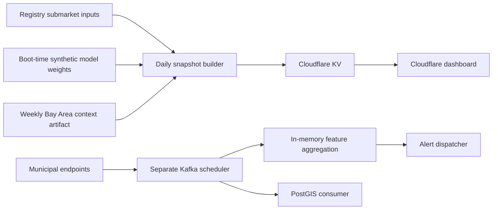

# Daily ingestion inventory

Audit date: 2026-10-03. Inspected merge `c59e691877fc7cd7493dfe75453438cda602918b`, production HTTP responses, GitHub workflow results, repository contracts, and bounded public NYC queries. This audit changes documentation only.

## Recommendation

Keep the Cloudflare dashboard and daily GitHub Actions snapshot. Build a **shadow NYC permit ingestion pilot with durable object storage** before switching map features or changing backend providers. Faster snapshot export has not established durable municipal ingestion or model validity. Provider migration would leave those issues unresolved.

## What supplies the dashboard

There is no implemented PostGIS/aggregation-store read in the snapshot path shown here. `apps/api/src/export/snapshot_builder.py` calls `router.get_grid_geojson` and `get_active_catalysts`; `apps/api/src/serving/router.py` derives `synthetic_feats` from registry submarket metadata. Optional context joins occur after inference. `apps/api/src/serving/engine.py::_init_models` initializes synthetic baseline/default weights rather than loading a validated municipal-data model bundle. A successful snapshot therefore verifies publication, not municipal data quality or predictive accuracy.

## Confirmed production evidence

| Observation | Evidence / implication |
| --- | --- |
| Manual refresh after merge succeeded | [Run 37160327023](https://github.com/harlanljones/urban-signal/actions/runs/37160327023); validation 151 seconds, snapshot job 107 seconds; builder elapsed 27.67 seconds. |
| Published snapshot | `2026-10-03T23:04:02.897904+00:00`; 157 cities, 11,185 cells, 13,154 keys and 504 tiles. Health, prediction/SHAP and production zoom checks passed in the deployment verification. |
| Scheduled evidence | No post-merge scheduled cycle yet at audit time. A manual success is not several days of reliability evidence. |
| Context freshness | Source artifact generated `2026-09-28T17:14:56.595918+00:00`, about 126 hours before publication. LODES, market and Overture layers report `ok`; transit skipped because `BAY_511_API_KEY` is absent; Bay Area permits failed with `no hexes produced`. These statuses concern the context overlay, not NYC streaming ingestion. |
| Feed-monitor checks | Recent push/PR checks succeeded, but those execute validation. `.github/workflows/feed-staleness.yml` probes only on schedule/manual invocation; endpoint freshness does not prove ingestion freshness. Manual default can send configured webhooks, so it was not triggered during this audit. |

Production health/manifest: `https://us-dash.harlanljones.com/health` and `/api/v1/manifest`. Reproducible measurements and source hashes are in [the Phase 1 benchmark](gh-actions-backend-benchmark-2026-10-03.md). Local verification receipts are under `/workspace/backend-phase1/`; public-query receipts under `/workspace/ingestion-audit/`. These workspace files are evidence aids, not durable application storage.

## Configured backend versus known deployment

The registry contains 157 cities and 438 dataset contracts: 88 Socrata, 297 ArcGIS, 24 CSV, 16 CKAN, five Excel, four GBFS and four CARTO. Modes are 269 incremental and 169 snapshot. Registration is not proof that a feed is running, complete or fresh.

| Component | Repository configuration | Deployment / state finding |
| --- | --- | --- |
| Scheduler | Compose runs `--jobs permits 311 sla deeds --interval 60 --limit 500`, the NYC jobs; registry supports wider coverage. | `scheduler_state_file` defaults empty, disabling persistence despite a `/data` bind mount. Actual override and remote service status unknown. |
| Kafka / schema registry | Compose single-broker topology; Kubernetes manifests also exist. | Actual broker location, retention, lag, delivery failures and monthly charge unknown. Repository manifests are not inventory evidence. |
| Feature aggregation | Four feature-relevant feeds; backfill records skipped; five-minute per-cell cooldown. | Default DuckDB is `:memory:`; ADR 0008 explicitly requires one aggregation instance. Restart loses raw feature state. |
| API feature pipeline | Each API process initializes its own default `SpatialFeaturePipeline`. | No shared aggregation-state restore/read in this serving initialization. |
| PostGIS | Persistence consumer and schemas; Compose named `postgis_data` volume. | Remote row counts, volume size, backups, ownership and real users unknown. Permit primary key is bare `job_id` despite a city column. |
| MinIO / feature-model buckets | Compose named `minio_data` and bucket bootstrap. | Provisioned remote storage, contents, credentials, billing and dashboard consumption unknown. |
| Alert dispatcher | Streaming enriched/alert topics; calibration gate and per-city budget. | `alert_state_file` defaults empty; actual recipients, traffic and durable configuration unknown. Retain dependencies until audited. |
| Cloudflare / Actions | Successful main dashboard release and manual KV publication. | Verified active. No municipal pilot bucket or storage authorization established by this audit. |

Workspace Docker enumeration returned no running containers after permitted access. This establishes only the local workspace state. No authenticated remote infrastructure or billing inventory was available; **current total backend spend cannot be determined**. Do not infer that remote Kafka/PostGIS services are idle or safe to retire.

## Correctness gaps to address

1. `scheduler.py::_poll_job` deduplicates by ID before parsing/publishing. A changed row with the same ID can be suppressed while resident in the cache. Its capped polls also explicitly warn that boundary rows can be skipped after a stalled watermark.
2. `BaseKafkaProducer.produce` can route errors to DLQ without propagating failure; delivery callbacks only log failures. `flush` discards Kafka's outstanding-message count. Scheduler then advances its watermark and records success. This is not an acknowledged durable commit boundary.
3. Scheduler checkpoints are optional local JSON, and save failures log warnings. An ephemeral Actions runner needs durable raw pages and checkpoint commits; simply running this scheduler there would not solve persistence.
4. DuckDB raw-table primary keys and consumer insert projections omit city/feed identity. IDs can collide across datasets/cities; Kafka's city-prefixed key does not repair downstream table keys.
5. Windows depend on explicit as-of time. Even with no new records, rolling counts and capex decay must change daily. Recompute the complete baseline before considering incremental feature optimization.
6. ADR 0008 says the batch builder owns backfill coverage, but the current snapshot code does not read the persisted municipal history. Treat this as a documentation/code gap, not completed integration.

## NYC pilot source facts and remaining gates

Enabled registry contract: city `nyc`, feed `permits`, scheduler job `permits`, topic `raw.municipal.permits`, producer `permits`; endpoint [DOB Permit Issuance, ipu4-2q9a](https://data.cityofnewyork.us/resource/ipu4-2q9a.json). Registry watermark is text `issuance_date`, format `%m/%d/%Y`; ID precedence begins `job__`. Live count query returned **3,990,806 rows**.

Metadata exposes `permit_si_no`, `job__`, job document/sequence/type fields, text issuance dates, GIS coordinates, and `dobrundate`. It exposes **no estimated-cost column**: the existing parser falls back to zero cost. This feed alone cannot supply meaningful capex or a complete four-feed LIMS signal.

A bounded `$select=:id,:updated_at,permit_si_no,job__,issuance_date,dobrundate` query succeeded. Three sample rows have distinct row IDs and permit serials, issuance dates in June 2020, and system update timestamps in May 2026. Thus event time and ingestion update time are demonstrably different. Dataset metadata's `rowsUpdatedAt` is a dataset-level timestamp, not a row cursor. Unrestricted `:id,:updated_at,*` selection returned HTTP 400; use explicit projected fields.

Dataset metadata reported an update at `2026-10-03T01:40:32+00:00`. A bounded lookup for job `340733647` returned two distinct permit serials (`3765466` and `3763757`), both document/sequence `01` and type `EW`: **job number is demonstrably not a unique permit-row key**, and that simple document/sequence/type composite is insufficient too.

Stable business-ID uniqueness, system-ID continuity across publisher replacements, timestamp filtering/keyset boundaries, late-correction visibility, deletion visibility, complete reconciliation consistency and documented API quota remain **unverified**. A full distinct-ID aggregate and an ordered update-time query timed out; do not mistake either for a passed check. No full 4-million-row download was performed. Validate these source guarantees before implementing the pilot; defer capex until an authoritative cost-bearing source/join is established.

## Cost and priority

The deployed daily refresh is approximately **150 per-job-rounded runner minutes per 30 days**, based on the measured 151-second validation and 107-second publication jobs. The repository is public; eligible standard GitHub-hosted runner compute is $0. This excludes context workflows, code releases, storage and every unobserved backend bill. It is a workload estimate, not an invoice.

Pilot cost is unmeasured: record bootstrap versus daily-delta duration, compressed bytes, object counts, reconciliation reads, retries and API throttling. A four-million-row initial import could dominate both time and storage. For scale only, an additional 10-minute job/day adds 300 runner minutes/month; at 30 minutes/day it adds 900. Stay with Actions while bounded daily runs fit its limits; consider Cloud Run/AWS batch for a measured bootstrap or runtime limit, rather than selecting Railway/Fly from speculative utilization.

Next: close the source/storage gates in [the pilot specification](../superpowers/specs/daily-ingestion-pilot.md), run seven shadow cycles, then decide how real features enter the snapshot. Retain streaming alerts, Kafka and PostGIS until actual users, retention and replacement behavior are verified.
