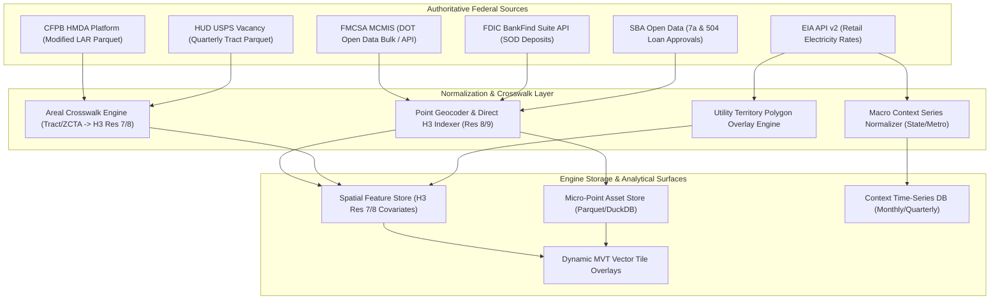
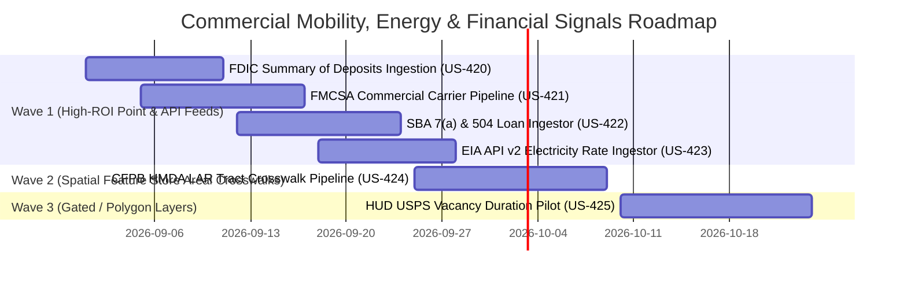

# Comprehensive Research Report: Federal Commercial Mobility, Energy, and Financial Signals

**Report Date:** 2026-08-30  
**Research Stream:** National Context, Commercial Mobility, Energy & Financial Intelligence  
**Target Path:** `docs/research/federal-mobility-energy-financial-signals-2026-08-30.md`  
**Target System:** Urban Signal Platform (Spatial Feature Store & Context Engine)

---

### Executive Summary

Urban Signal anchors high-velocity municipal event streams (**Permits**, **311 Service Requests**, **State/Local Business & Professional Licenses [SLA]**, and **Deeds / Real Estate Transactions**) across 103 registered U.S. metropolitan regions against national context baselines (BLS QCEW, Census BFS/LODES, FEMA NFHL, EPA ECHO, NOAA GHCN-D, AirNow AQI, FTA NTD, NHTSA FARS).

This research probe evaluates the next wave of **six high-value federal commercial mobility, energy, and micro-financial datasets**:
1. **FMCSA SAFER & MCMIS**: Commercial carrier registrations, fleet sizes, safety audits, hazmat authority, and base-of-operations geocodes.
2. **EIA Form 861 & State Retail Electricity Rates**: Utility-level and state-level commercial and industrial retail electricity rates ($/kWh), utility service territory boundaries, and clean energy portfolio shares.
3. **CFPB HMDA Loan Application Register (LAR)**: Micro-lending volume, loan purpose, denial rates, LTV ratios, and interest rate spreads by Census Tract (re-evaluated in the context of the spatial feature store).
4. **FDIC Summary of Deposits (SOD)**: Bank branch locations, deposit totals ($), branch opening/closure velocities per hex/ZIP/tract.
5. **SBA 7(a) & 504 Business Loan Approvals**: Small business lending volumes, loan amounts, NAICS industry classification, jobs created/retained commitments by ZIP/Tract.
6. **HUD / USPS Aggregated Vacancy Duration Data**: Quarterly postal route vacancy duration breakdowns (active, vacant <3 mo, 3-6 mo, 6-12 mo, 12-24 mo, 24-36 mo, >36 mo, no-stat) for residential and commercial addresses.

---

### Federal Feed Evaluation Summary Table

| Dataset Name | Agency | Spatial Grain | Temporal Cadence & Lag | Access Platform / API / Bulk | Schema / Join Keys | Ingestion Complexity | Recommendation |
| :--- | :--- | :--- | :--- | :--- | :--- | :--- | :--- |
| **FMCSA SAFER / MCMIS** | USDOT / FMCSA | Exact Point / ZIP / County | Monthly bulk census (~30d lag); Real-time QCMobile API | `data.transportation.gov` Bulk CSV; QCMobile REST API | `DOT_NUMBER`, `PHY_STREET`, `PHY_CITY`, `PHY_STATE`, `PHY_ZIP`, FIPS | Low–Medium (Geocode / ZIP-to-H3 indexer) | **ADOPT / REGISTER (Wave 1)** |
| **EIA Form 861 & Retail Rates** | DOE / EIA | Utility Service Territory / State / County | Monthly (861M) & Annual (861) (~60d / ~9mo lag) | EIA Open Data API v2 (`/v2/electricity/retail-sales/data`); ICPSR HIFLD GIS | `utility_id_eia`, `stateid`, `sectorid`, Utility Polygon $\cap$ H3 | Low–Medium (API time-series + polygon crosswalk) | **ADOPT (Wave 1 Series / Wave 2 Spatial)** |
| **CFPB HMDA LAR** | CFPB / FFIEC | Census Tract (11-digit FIPS) | Annual census (~9–12mo lag) | FFIEC HMDA Platform Bulk Parquet/CSV; Data Browser API v2 | `census_tract` (11-digit FIPS), `lei`, `county_code` | Low (Tract-to-H3 crosswalk parquet) | **ADOPT (Spatial Feature Store Wave 2)** |
| **FDIC Summary of Deposits (SOD)** | FDIC | Exact Point (Lat/Lon) & Branch Address | Annual survey as of June 30 (released Sept/Oct, ~90d lag) | FDIC BankFind Suite API (`api.fdic.gov/banks`); Bulk CSV Generator | `UNINUMBR`, `CERT`, `SIMS_LATITUDE`, `SIMS_LONGITUDE`, `ZIP`, FIPS | Low (Direct Point H3 Indexer) | **ADOPT / REGISTER (Wave 1)** |
| **SBA 7(a) & 504 Approvals** | SBA | ZIP (5-digit) & Borrower Address / Tract | Quarterly FOIA release (~30–45d lag) | `data.sba.gov` Bulk CSV/XLSX / Data.gov Catalog | `BorrowerZip`, `BorrowerCity`, `BorrowerState`, `NAICSCode`, Tract | Low–Medium (ZCTA/Address to H3 aggregation) | **ADOPT / REGISTER (Wave 1)** |
| **HUD / USPS Vacancy Duration** | HUD (PD&R) / USPS | Census Tract (11-digit FIPS) / ZIP Crosswalk | Quarterly (~30–60d lag) | HUD User Aggregated USPS Portal (Restricted Sublicense / Research Portal) | `GEOID` (11-digit Tract), `RES_VAC`, `BUS_VAC`, `VAC_<3` to `VAC_>36` | Low (Tract-to-H3 crosswalk) | **PILOT / PROXY (Wave 3 - License Gated)** |

---

### Deep-Dive Per Dataset

#### 1. FMCSA SAFER & MCMIS (Federal Motor Carrier Safety Administration)
* **Agency & Program:** U.S. Department of Transportation, Federal Motor Carrier Safety Administration.
* **Primary Access Surfaces:**
  - **Bulk Data Catalog:** USDOT Open Data (`https://data.transportation.gov/d/4a2k-zf79` - Company Census File; `datahub.transportation.gov`).
  - **Programmatic API:** FMCSA QCMobile API (`https://mobile.fmcsa.dot.gov/developer/`) using Login.gov authentication and developer WebKeys for real-time carrier snapshots.
* **Licensing:** Public Domain (17 U.S.C. § 105 / US Government Work).
* **Spatial & Temporal Grain:** Physical address geocoding (Lat/Lon), 5-digit ZIP (`PHY_ZIP`), State/County FIPS; updated monthly in bulk files.
* **Key Schema Fields:**
  - `DOT_NUMBER`: Primary unique key assigned by MCMIS.
  - `LEGAL_NAME`, `DBA_NAME`: Entity legal and operating names.
  - `PHY_STREET`, `PHY_CITY`, `PHY_STATE`, `PHY_ZIP`, `PHY_CNTY`: Operating base of operations.
  - `CARRIER_OPERATION`: Code (`A` = Interstate, `B` = Intrastate Hazmat, `C` = Intrastate Non-Hazmat).
  - `TOTAL_POWER_UNITS`, `TOTAL_DRIVERS`: Fleet scale and operator headcount.
  - `NBR_POWER_UNIT_INSPECTION`, `TOTAL_INSPECTIONS`, `TOTAL_CRASHES`: Safety and enforcement exposure.
  - `MCS150_DATE`: Vintage of most recent biennial carrier registration update.
  - `HAZMAT_FLAG`: Authorization and active carriage of hazardous materials.
* **Join Keys & H3 Indexing:** Physical address geocoded $\rightarrow$ `H3SpatialIndexer` res 7, 8, 9; secondary rollup by `PHY_ZIP` via ZCTA crosswalk.
* **Analytical Value:**
  - Establishes micro-spatial **Industrial Fleet & Logistics Hub Density**.
  - Corroborates commercial building permits (distribution centers, truck parking, cross-dock logistics) and industrial zoning compliance.
  - Identifies hazardous material freight concentration corridors across metro submarkets.

#### 2. EIA Form 861 & State Retail Electricity Rates
* **Agency & Program:** U.S. Department of Energy, Energy Information Administration (EIA).
* **Primary Access Surfaces:**
  - **EIA API v2:** `https://api.eia.gov/v2/electricity/retail-sales/data?api_key=KEY&frequency=monthly` (also `annual`).
  - **EIA Form 861 / 861M Detailed Tabular Files:** `https://www.eia.gov/electricity/data/eia861/` (Utility-level customer counts, revenues, MWh sales, green pricing programs).
  - **Geospatial Utility Boundaries:** HIFLD Electric Retail Service Territories (archived on ICPSR DOI: `10.3886/E239091V2`) / NREL OpenEI utility crosswalks.
* **Licensing:** Public Domain (17 U.S.C. § 105).
* **Spatial & Temporal Grain:** Utility Service Territory polygon $\rightarrow$ County / Tract / H3; State-level monthly time-series; Annual utility-level census.
* **Key Schema Fields:**
  - `period`: YYYY-MM or YYYY.
  - `stateid`: Two-letter state code.
  - `sectorid`: `RES` (Residential), `COM` (Commercial), `IND` (Industrial), `TRA` (Transportation), `ALL` (Total).
  - `price`: Average retail electricity price in cents per kilowatthour ($\text{c/kWh}$).
  - `revenue`: Revenue from retail electricity sales ($\$ \text{Thousand}$).
  - `sales`: Retail sales of electricity ($\text{Megawatthours}$).
  - `customers`: Number of retail customer accounts.
  - Form 861 Add-ons: `green_pricing_sales_mwh`, `net_metering_capacity_mw`, `demand_response_mw`.
* **Join Keys & H3 Indexing:** State-level series linked by `state_fips`; Utility service territory polygons intersected with metro H3 res-7/8 cells.
* **Analytical Value:**
  - Provides a critical commercial operating cost index ($/kWh commercial & industrial power rate).
  - Tracks energy transition and electrification readiness (net-metering, commercial solar permits, EV fleet charging capacity).
  - Explains capex-intensive industrial and data center permit deployments across competing utility service territories.

#### 3. CFPB HMDA Loan Application Register (LAR)
* **Agency & Program:** Consumer Financial Protection Bureau (CFPB) & FFIEC.
* **Primary Access Surfaces:**
  - **FFIEC HMDA Platform / Bulk Parquet/CSV:** `https://ffiec.cfpb.gov/data-publication/modified-lar` (Combined annual files and state slices).
  - **HMDA Data Browser API v2:** `https://ffiec.cfpb.gov/v2/data-browser-api/view/csv?states=CA&years=2024`.
  - **CFPB HMDA Platform GitHub API:** `https://github.com/cfpb/hmda-platform`.
* **Licensing:** Public Domain (17 U.S.C. § 105).
* **Spatial & Temporal Grain:** Census Tract (11-digit FIPS `state` + `county` + `tract`); annual release (~9-12 month validation cycle).
* **Key Schema Fields:**
  - `lei`: Legal Entity Identifier of financial institution.
  - `census_tract`: 11-digit 2020 Census Tract FIPS.
  - `action_taken`: 1=Originated, 2=Approved not accepted, 3=Denied, 4=Withdrawn, 5=Closed incomplete.
  - `loan_purpose`: 1=Home purchase, 2=Home improvement, 31=Refinance, 32=Cash-out refinance, 4=Other.
  - `occupancy_type`: 1=Principal residence, 2=Second residence, 3=Investment property.
  - `loan_amount`: Mortgage loan volume ($).
  - `property_value`: Assessed/appraised property value.
  - `loan_to_value_ratio` (LTV): Combined LTV ratio.
  - `interest_rate`, `rate_spread`: Pricing relative to APOR benchmark.
  - `total_units`: 1-4 units vs Multifamily ($\ge 5$ units).
* **Join Keys & H3 Indexing:** `census_tract` (11-digit FIPS) $\rightarrow$ Areal crosswalk to H3 Res 7/8.
* **Analytical Value:**
  - Distinct from `DEEDS` (which records ownership transfers but lacks financing metadata): reveals **Investor-Occupancy Share** ($>30\%$ investor loan concentration).
  - Measures **Mortgage Denial Rate & Credit Friction** by submarket.
  - Tracks capital investment velocity for residential rehabilitation via **Home Improvement Lending Volume**, directly corroborating residential renovation building permits.

#### 4. FDIC Summary of Deposits (SOD)
* **Agency & Program:** Federal Deposit Insurance Corporation (FDIC).
* **Primary Access Surfaces:**
  - **BankFind Suite API:** `https://api.fdic.gov/banks` (Endpoints: `/locations`, `/institutions`, `/sod`).
  - **OpenAPI / Swagger Spec:** `https://api.fdic.gov/banks/docs` (YAML definitions, Elasticsearch query syntax).
  - **Bulk Data Generator:** `https://banks.data.fdic.gov/bankfind-suite/bulk-data-download` (Annual SOD `.csv` archives).
* **Licensing:** Public Domain (17 U.S.C. § 105).
* **Spatial & Temporal Grain:** Point branch geocodes (`SIMS_LATITUDE`, `SIMS_LONGITUDE`), street address, ZIP, County FIPS; Annual census as of June 30 (published every fall).
* **Key Schema Fields:**
  - `UNINUMBR`: Unique branch location identifier.
  - `CERT`: FDIC Certificate number of parent bank institution.
  - `NAMEFULL`: Parent bank name.
  - `OFFNAME`: Branch office name.
  - `ADDRESS`, `CITY`, `STNAME`, `ZIP`: Branch street address.
  - `SIMS_LATITUDE`, `SIMS_LONGITUDE`: High-accuracy branch geocoordinates.
  - `DEPSUMBR`: Total domestic deposits held at branch office ($\$ \text{Thousand}$).
  - `BKMO`: Main Office vs Branch indicator (`1` = Main Office, `0` = Branch).
  - `BRSERVT`: Branch service type (Full service brick-and-mortar, retail drive-through only, mobile branch).
  - `DATEUPDT`: Date of last physical branch structure / address change.
* **Join Keys & H3 Indexing:** `SIMS_LATITUDE`, `SIMS_LONGITUDE` mapped directly via `H3SpatialIndexer` (res 7, 8, 9).
* **Analytical Value:**
  - Measures **Local Banking Liquidity & Branch Deposit Density** ($\$ \text{deposits} / \text{km}^2$).
  - Detects **Branch Expansion & Retrenchment Velocities** (net branch openings vs closures per hex over 1/3/5-year windows).
  - Identifies banking deserts and financial accessibility corridors, correlating with commercial storefront vacancies and SLA retail registrations.

#### 5. SBA 7(a) & 504 Business Loan Approvals
* **Agency & Program:** U.S. Small Business Administration (SBA).
* **Primary Access Surfaces:**
  - **SBA Open Data Portal:** `https://data.sba.gov/` (`sba-7a-and-504-loan-data-reports`).
  - **Data.gov Catalog:** FOIA small business loan approval CSV/XLSX downloads.
* **Licensing:** Public Domain (17 U.S.C. § 105).
* **Spatial & Temporal Grain:** Business address, 5-digit ZIP (`BorrowerZip`), City, State, County; updated quarterly (~30-day lag).
* **Key Schema Fields:**
  - `LoanNumber`: Unique SBA loan identifier.
  - `Program`: `7A` (working capital / equipment / general financing) or `504` (major fixed asset / real estate financing).
  - `BorrName`, `BorrStreet`, `BorrCity`, `BorrState`, `BorrZip`: Small business borrower details.
  - `BankName`, `BankStreet`, `BankCity`, `BankState`: Originating lender details.
  - `GrossApproval`: Total authorized loan amount ($).
  - `SBAGuaranteedApproval`: Federal guaranteed loan portion ($).
  - `ApprovalDate`, `ApprovalFiscalYear`: Transaction timeline.
  - `TermInMonths`, `InitialInterestRate`: Financing terms.
  - `NaicsCode`, `NaicsDescription`: 6-digit NAICS industry classification.
  - `JobsSupported` / `CreateJobCount`, `RetainJobCount`: Job creation & retention commitments.
  - `BusinessAgeCode`: `Change of Ownership`, `New Business (<=2 yrs)`, `Existing Business (>2 yrs)`.
  - `LoanStatus`: `PaidInFull`, `Exempt`, `Commit`, `CHGOFF` (Charge-off / default).
* **Join Keys & H3 Indexing:** Geocoded borrower address $\rightarrow$ H3 res 8/9; secondary ZCTA crosswalk rollup for ZIP-only records.
* **Analytical Value:**
  - Directly measures **Micro-Business Capital Inflow** ($/hex/quarter).
  - Corroborates **SLA New Business Licensing**: tracks the financing behind newly registered enterprises.
  - SBA 504 loans (commercial real estate & heavy machinery) directly precede commercial building permits and tenant improvement buildouts.

#### 6. HUD / USPS Aggregated Vacancy Duration Data
* **Agency & Program:** U.S. Department of Housing and Urban Development (PD&R) & United States Postal Service.
* **Primary Access Surfaces:**
  - **HUD User Portal:** `https://www.huduser.gov/portal/datasets/usps.html`.
  - **HUD User Sublicense Portal:** Quarterly Tract-level files (`USPS_VACANCY_[YYYY]Q[1-4].csv`).
* **Licensing Nuance:** Sublicensed administrative data. Free access for researchers and public-good analytics; restricted commercial re-distribution under standard HUD Sublicense Agreement.
* **Spatial & Temporal Grain:** Census Tract (11-digit FIPS `GEOID`); quarterly updates (~30–60 day lag).
* **Key Schema Fields:**
  - `GEOID`: 11-digit Census Tract FIPS.
  - `AMS_RES`: Total Active Mail Delivery Residential Addresses.
  - `AMS_BUS`: Total Active Mail Delivery Business/Commercial Addresses.
  - `RES_VAC`: Total Vacant Residential Addresses (accumulating >90 days undelivered mail).
  - `BUS_VAC`: Total Vacant Business Addresses.
  - Duration Breakdowns:
    - `VAC_<3`: Vacant $<3$ months (churn / frictional turnover).
    - `VAC_3TO6`: Vacant 3–6 months.
    - `VAC_6TO12`: Vacant 6–12 months (medium-term vacancy).
    - `VAC_12TO24`: Vacant 12–24 months (chronic vacancy).
    - `VAC_24TO36`: Vacant 24–36 months.
    - `VAC_>36`: Vacant $>36$ months (structural abandonment / blight).
  - `NOSTAT_RES`, `NOSTAT_BUS`: Addresses under construction, non-deliverable, or demolished.
* **Join Keys & H3 Indexing:** `GEOID` $\rightarrow$ Areal weighting crosswalk to H3 res 7/8.
* **Analytical Value:**
  - Provides a definitive, universal **Commercial Storefront Vacancy Baseline** (`BUS_VAC / AMS_BUS`).
  - Separates **Healthy Frictional Turnover** (`VAC_<3`) from **Structural Blight** (`VAC_>36`).
  - Grounds 311 building disrepair complaints and deed distress transactions in empirical postal delivery facts.

---

### Proposed Architectural Integration Path

#### Architecture Storage & Benchmarks
1. **Point Asset & Micro-Event Store (FDIC SOD, FMCSA Carriers, SBA Loans)**:
   - *Storage*: Partitioned Parquet (`metro_id` / `year`) + DuckDB query engine.
   - *Volume*: ~85,000 FDIC bank branches (annual snapshot), ~2.1M active FMCSA registered carriers, ~65,000 SBA 7(a)/504 loan approvals/year.
   - *Footprint*: $\approx 1.8\text{ GB}$ nationally; per-metro slice $\approx 10\text{--}45\text{ MB}$.
2. **Spatial Feature Store Covariates (HMDA, HUD-USPS Vacancy, EIA Rates)**:
   - *Storage*: SQLite / DuckDB tables indexed by `h3_res8_id` with columnar feature vectors.
   - *Volume*: 103 registered metros contain $\approx 1,250,000$ active H3 res-8 cells.
   - *Feature Width*: ~35 additional float covariates $\approx 175\text{ MB}$ total footprint nationally.
3. **Context Time Series DB (EIA Monthly State Rates, Quarterly Metro SBA Totals)**:
   - *Storage*: SQLite / Parquet macro series indexed by `(metro_id, period)`.

---

### Implementation Phasing & Linear Ticket Specifications

#### Ticket Spec 1: `US-420` — Ingest FDIC Summary of Deposits (SOD) Bank Branch Points & Deposit Totals
* **Title:** `feat(spatial): FDIC SOD bank branch geocodes and deposit density prior`
* **Type:** Feature (Leaf Module)
* **Target Paths:** `apps/api/src/spatial/fdic_sod.py`, `apps/api/tests/unit/test_fdic_sod.py`
* **Implementation Details:**
  1. Build `FdicSodClient` to query FDIC BankFind Suite API (`https://api.fdic.gov/banks/locations` & `/sod`) or parse annual bulk CSV downloads.
  2. Ingest `UNINUMBR`, `CERT`, `NAMEFULL`, `SIMS_LATITUDE`, `SIMS_LONGITUDE`, `DEPSUMBR`, `BKMO`, `BRSERVT`, `DATEUPDT`.
  3. Map branch points to H3 res 7, 8, 9 using `H3SpatialIndexer`.
  4. Calculate branch opening/closure velocity and total deposit volume per hex cell.
  5. Unit tests with mocked FDIC API JSON responses and edge-case geocodes.

#### Ticket Spec 2: `US-421` — Ingest FMCSA SAFER & MCMIS Commercial Carrier Census
* **Title:** `feat(spatial): FMCSA commercial carrier registration and fleet density prior`
* **Type:** Feature (Leaf Module)
* **Target Paths:** `apps/api/src/spatial/fmcsa_carriers.py`, `apps/api/tests/unit/test_fmcsa_carriers.py`
* **Implementation Details:**
  1. Implement parser for USDOT Open Data Company Census file (`Company_Census.csv`).
  2. Extract `DOT_NUMBER`, `LEGAL_NAME`, `PHY_STREET`, `PHY_CITY`, `PHY_STATE`, `PHY_ZIP`, `CARRIER_OPERATION`, `TOTAL_POWER_UNITS`, `TOTAL_DRIVERS`, `HAZMAT_FLAG`.
  3. Geocode physical operating base and map to H3 cells; compute industrial fleet power unit density per submarket.
  4. Unit test address parsing, hazmat flag parsing, and missing coordinate rollups.

#### Ticket Spec 3: `US-422` — Ingest SBA 7(a) and 504 Small Business Loan Approvals
* **Title:** `feat(spatial): SBA 7(a) & 504 micro-business lending volume ingestion`
* **Type:** Feature (Leaf Module)
* **Target Paths:** `apps/api/src/spatial/sba_loans.py`, `apps/api/tests/unit/test_sba_loans.py`
* **Implementation Details:**
  1. Implement `SbaLoanIngestor` for quarterly SBA FOIA datasets from `data.sba.gov`.
  2. Extract `LoanNumber`, `Program`, `GrossApproval`, `ApprovalDate`, `NaicsCode`, `JobsSupported`, `BorrowerZip`, `BorrowerCity`, `BorrowerState`.
  3. Aggregate quarterly small business capital injection ($) and supported jobs per ZCTA / H3 cell; calculate industry loan share by 2-digit NAICS sector.
  4. Unit test schema validation, multi-decade CSV parsing, and ZCTA-to-H3 mapping.

#### Ticket Spec 4: `US-423` — Ingest EIA Form 861 Retail Electricity Price Series & Utility Territories
* **Title:** `feat(context): EIA API v2 commercial & industrial electricity retail rate series`
* **Type:** Feature (Leaf Module)
* **Target Paths:** `apps/api/src/spatial/eia_electricity.py`, `apps/api/tests/unit/test_eia_electricity.py`
* **Implementation Details:**
  1. Build `EiaElectricityClient` querying EIA API v2 endpoint `/v2/electricity/retail-sales/data`.
  2. Fetch monthly and annual retail electricity rates (`price`, $\text{c/kWh}$), sales (`sales`, MWh), and customer counts (`customers`) by state and sector (`COM`, `IND`, `RES`).
  3. Store context series in macro database; provide utility service territory rate lookups for metro feature store.
  4. Unit test API query generation, rate parsing, and missing period fallbacks.

#### Ticket Spec 5: `US-424` — Ingest CFPB HMDA Loan Application Register (LAR) into Spatial Feature Store
* **Title:** `feat(spatial): CFPB HMDA mortgage lending volume, investor share & denial rate crosswalk`
* **Type:** Feature (Leaf Module)
* **Target Paths:** `apps/api/src/spatial/cfpb_hmda.py`, `apps/api/tests/unit/test_cfpb_hmda.py`
* **Implementation Details:**
  1. Build parser for annual FFIEC HMDA modified LAR Parquet/CSV files.
  2. Aggregate loan applications by 11-digit `census_tract`: total volume ($), home purchase volume, home improvement volume, investor-occupancy share (`occupancy_type == 3`), denial rate (`action_taken == 3`).
  3. Apply tract-to-H3 areal weighting to emit res 7/8 spatial feature vectors for all registered metros.
  4. Unit test tract parsing, aggregation math, and zero-loan tract boundary conditions.

#### Ticket Spec 6: `US-425` — HUD / USPS Postal Vacancy Duration Breakdown Integration
* **Title:** `feat(spatial): HUD USPS quarterly postal vacancy duration breakdown`
* **Type:** Feature (Leaf Module)
* **Target Paths:** `apps/api/src/spatial/hud_usps_vacancy.py`, `apps/api/tests/unit/test_hud_usps_vacancy.py`
* **Implementation Details:**
  1. Build `HudUspsVacancyParser` for quarterly tract files under the HUD User portal format.
  2. Extract `AMS_RES`, `AMS_BUS`, `RES_VAC`, `BUS_VAC`, `VAC_<3`, `VAC_3TO6`, `VAC_6TO12`, `VAC_12TO24`, `VAC_24TO36`, `VAC_>36`, `NOSTAT_RES`, `NOSTAT_BUS`.
  3. Calculate Commercial Vacancy Ratio (`BUS_VAC / AMS_BUS`) and Structural Blight Ratio (`VAC_>36 / (RES_VAC + BUS_VAC)`) per tract, mapped to H3 res 8.
  4. Unit test data dictionary parsing, duration bucket validation, and crosswalk weighting.

---

### Conclusion & Recommendation

The evaluated federal feeds provide unprecedented depth across commercial mobility (FMCSA), operating energy costs (EIA), liquidity & banking presence (FDIC SOD), small business capital inflow (SBA), credit access & investor concentration (CFPB HMDA), and ground-truth storefront vacancy durations (HUD USPS). 

All proposed ingestors are designed as **leaf modules** in `apps/api/src/spatial/`, interfacing with the platform's `H3SpatialIndexer` and spatial feature store without destabilizing the core spine. Wave 1 implementation can commence immediately with zero spine interlock risk.
