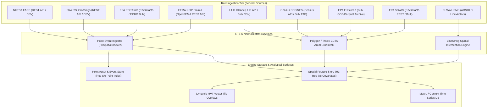
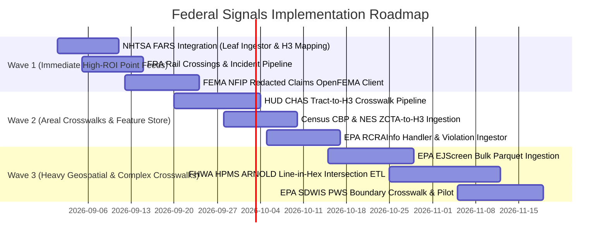

# National Environmental & Infrastructure Signals: Comprehensive Research Probe & Federal Dataset Evaluation

**Report Date:** 2026-08-30  
**Research Stream:** National Context & Environmental Infrastructure Signals  
**Target Path:** `docs/research/national-environmental-infrastructure-signals-2026-08-30.md`  
**Target System:** Urban Signal Platform (Spatial Intelligence & Context Layer)

---

## 1. Executive Summary & Strategic Context

Urban Signal ingests four high-velocity municipal core event streams (**Permits**, **311 Service Requests**, **State/Local Business & Professional Licenses [SLA]**, and **Deeds / Real Estate Transactions**) across 103 registered U.S. metropolitan regions. To transform these municipal event feeds into normalized, cross-metro spatial intelligence, the platform anchors local transaction velocities against national context baselines (e.g., BLS QCEW, Census BFS/LODES, HUD-USPS vacancy, FEMA NFHL, EPA ECHO, NOAA GHCN-D, AirNow AQI, and FTA NTD).

This research probe evaluates the next wave of **nine high-value federal environmental, infrastructure, mobility, and socioeconomic datasets** across three thematic pillars:
1. **EPA Environmental & Risk Layers**: EPA EJScreen, EPA Envirofacts / RCRAInfo, EPA SDWIS.
2. **Infrastructure, Mobility & Safety**: NHTSA / DOT FARS, FHWA HPMS, FRA Highway-Rail Grade Crossings.
3. **Housing Affordability & Economic Context**: HUD CHAS, Census CBP & NES, FEMA NFIP Redacted Claims.

### Headline Verdicts
* **Immediate High-ROI Adoptions (Wave 1)**:
  - **NHTSA FARS** (`ADOPT / REGISTER`): Micro-point geocoded fatal crash census; establishes exact H3 res 7–9 street safety and pedestrian vulnerability priors; integrates directly with existing point-event spatial indexers.
  - **FRA Rail Crossings** (`ADOPT / REGISTER`): 250k+ precise point assets with traffic counts, active protection devices, and historic accident logs; measures urban severance, noise nuisance, and barrier friction.
  - **FEMA NFIP Redacted Claims** (`ADOPT / REGISTER`): Ground-truth empirical flood loss payouts ($) at Census Tract / ZCTA / Lat-Lon grain; turns static NFHL flood zone polygons into empirical risk cost models.
* **Feature Store Enhancements (Wave 2)**:
  - **Census CBP & NES** (`ADOPT`): Universal annual establishment, employment, payroll, and nonemployer/gig-economy counts at County and ZCTA grain; complements quarterly BLS QCEW with deep sub-county retail/industrial industry structure.
  - **HUD CHAS** (`ADOPT`): The federal benchmark for housing cost burden (>30%, >50% AMI) and tenure breakdown by tract; grounds eviction and deed velocity in structural affordability distress.
  - **EPA Envirofacts / RCRAInfo** (`ADOPT / PILOT`): Facility-level hazardous waste handlers (LQG, SQG, TSDF) and corrective action violations via EPA FRS point coordinates.
* **Specialized / Pipeline-Gated Integrations (Wave 3)**:
  - **EPA EJScreen** (`INTEGRATE via Bulk Archive`): Comprehensive 12-indicator block-group environmental burden baseline; must use annual bulk parquet/geodatabase snapshots rather than deprecated live REST broker.
  - **FHWA HPMS** (`INTEGRATE via Spatial ETL`): AADT and truck freight volumes along ARNOLD line-network vectors; requires line-in-hex spatial intersection ETL.
  - **EPA SDWIS** (`PILOT via Utility Spatial Crosswalk`): Water system MCL / lead & copper violations; requires PWSID-to-county/tract spatial crosswalk table.

---

## 2. Federal Feed Evaluation Summary Table

| Dataset Name | Agency | Spatial Grain | Temporal Cadence & Lag | Access Platform / Protocol | Join Keys | Ingestion Complexity | Recommendation |
| :--- | :--- | :--- | :--- | :--- | :--- | :--- | :--- |
| **EPA EJScreen** | EPA (OITA) | Census Block Group (12-digit) & Tract | Annual snapshot (~6–12 mo lag) | Bulk GDB / CSV / Data Commons / Zenodo | 12-digit FIPS (`ID`), centroid lat/lon | Low–Medium (bulk parquet to H3 crosswalk) | **INTEGRATE (Bulk)** |
| **EPA RCRAInfo** | EPA (OLEM / OECA) | Point coordinate (FRS lat/lon) + County FIPS | Weekly in Envirofacts; Biennial BR | Envirofacts REST API & ECHO bulk ZIPs | `LATITUDE83`, `LONGITUDE83`, `HANDLER_ID` | Low (point H3 indexer) | **ADOPT / PILOT** |
| **EPA SDWIS** | EPA (OGWDW) | PWS Utility boundary / County FIPS | Quarterly federal reporting (~3 mo lag) | Envirofacts Data Service REST / Bulk CSV | `PWSID`, `COUNTY_SERVED`, FIPS | Medium (utility service area boundary crosswalk) | **PILOT** |
| **NHTSA FARS** | DOT / NHTSA | Exact Point (Lat/Lon WGS84) + County/City | Annual census release (~12 mo lag) | Crash Data REST API & bulk CSV/SAS | `LATITUDE`, `LONGITUD`, `ST_CASE`, County FIPS | Low (direct point-event pipeline) | **ADOPT / REGISTER** |
| **FHWA HPMS** | DOT / FHWA | Geospatial LineString (ARNOLD routes) | Annual state DOT submission (~12–15 mo lag) | NTAD / BTS GeoData / Shapefile / FileGDB | ARNOLD `ROUTE_ID`, Line-in-hex intersection | Medium–High (linear vector crosswalk) | **INTEGRATE (Spatial)** |
| **FRA Rail Crossings** | DOT / FRA | Exact Point (Lat/Lon WGS84) + RR Milepost | Monthly incident updates, continuous inventory | Master Web Service REST API & bulk CSV | `LATITUDE`, `LONGITUDE`, `CROSSING`, FIPS | Low (direct point-event pipeline) | **ADOPT / REGISTER** |
| **HUD CHAS** | HUD / Census | Census Tract (11-digit FIPS) & County | Annual 5-yr ACS tabulation (~24 mo lag) | HUD User REST API & Open Data bulk CSV | `geoid` (11-digit Tract FIPS) | Low (tract-to-H3 areal crosswalk) | **ADOPT** |
| **Census CBP & NES** | U.S. Census Bureau | County (5-digit) & ZCTA (5-digit ZIP) | Annual (~18–24 mo lag) | Census Bureau Data API & bulk FTP | `state` + `county`, `zipcode`, `naics` | Low (ZCTA-to-H3 crosswalk) | **ADOPT** |
| **FEMA NFIP Claims** | DHS / FEMA | Census Tract (11-digit), ZIP, approx lat/lon | Monthly / Quarterly refresh (~30–60 d lag) | OpenFEMA REST API v2/v3 & bulk CSV | `censusTract`, `reportedZipCode`, `latitude`/`longitude` | Low–Medium (tract/point aggregation) | **ADOPT / REGISTER** |

---

## 3. Deep-Dive Dataset Assessments

### Pillar 1: EPA Environmental & Risk Layers

#### 1.1 EPA EJScreen (Environmental Justice Screening & Mapping)
* **Agency & Program:** EPA Office of International and Tribal Affairs (OITA) / Office of Environmental Justice.
* **Primary Access Surface:**
  - Bulk Archive: EPA Data Commons / Zenodo / Harvard Dataverse (`EJSCREEN_[YEAR]_StatePctile.csv` and FileGeodatabase).
  - Web UI / GIS: ArcGIS Online Feature Layers.
  - *Note on Legacy API:* EPA-hosted `ejscreenRESTbroker` services were retired in early 2025; operational pipelines must ingest authoritative bulk snapshots.
* **Licensing:** Public Domain (17 U.S.C. § 105).
* **Spatial & Temporal Resolution:** Census Block Group (12-digit FIPS) across all 50 states + DC + PR; updated annually.
* **Key Schema Fields:**
  - Identifiers: `ID` (12-digit Block Group FIPS), `ST_ABBREV`, `CNTY_NAME`.
  - Environmental Burden Metrics: `PM25` (annual particulate matter $\mu g/m^3$), `OZONE` (summer seasonal avg ppb), `DSLPM` (diesel particulate matter), `CANCER` (air toxics cancer risk per million), `RESP` (air toxics respiratory hazard index), `RSEI_AIR` (toxic releases to air), `PTRAF` (traffic proximity and volume count within 500m / dist), `PRE1960PCT` (lead paint indicator: % housing built before 1960), `PNPL` (Superfund site proximity index), `PRMP` (RMP chemical facility proximity), `PTSDF` (hazardous waste TSDF facility proximity), `UST` (underground storage tanks / leaking UST index), `PWDIS` (wastewater discharge indicator).
  - Percentiles & Indices: `P_PM25`, `P_OZONE`, `P_LEAD`, `P_TRAFFIC`, `EJ_INDEX_PM25`, `SUPP_EJ_INDEX_PM25`.
  - Demographics: `LOWINCPCT` (% low income <=200% poverty), `MINORITYPCT`, `LESSHSPCT`, `LINGISOPCT`, `OVER64PCT`, `UNDER5PCT`.
* **Join Keys & H3 Crosswalk:** `ID` (12-digit FIPS) $\rightarrow$ Areal weighting crosswalk to H3 Res-7 (neighborhood macro), Res-8 (standard hex), and Res-9 (micro-block).
* **Urban Signal Analytical Value:** Provides an 11-dimension environmental quality baseline for all 103 metros. Informs the **Environmental Compliance Risk Score (ECRS)** and explains persistent 311 environmental complaints and permit lead-abatement requirements.

---

#### 1.2 EPA Envirofacts / RCRAInfo (Hazardous Waste Handlers & Violations)
* **Agency & Program:** EPA Office of Land and Emergency Management (OLEM) & OECA.
* **Primary Access Surface:**
  - Envirofacts Data Service API: `https://data.epa.gov/efservice/` (e.g., `https://data.epa.gov/efservice/RCRA_HD_HANDLER/JSON`, `RCRA_CME_VIOLATION/JSON`).
  - ECHO Bulk Downloads: `https://echo.epa.gov/files/echodownloads/rcra_rest_services.zip` / `echo_exporter.zip`.
  - RCRA Biennial Report (BR) Data Files.
* **Licensing:** Public Domain (17 U.S.C. § 105).
* **Spatial & Temporal Resolution:** Point coordinates (`LATITUDE83`, `LONGITUDE83` via EPA FRS); weekly refresh in Envirofacts.
* **Key Schema Fields:**
  - Facility Identifiers: `HANDLER_ID` (12-character EPA ID), `HANDLER_NAME`, `STREET1`, `CITY`, `STATE`, `ZIP`, `COUNTY_FIPS`.
  - Geocodes: `LATITUDE83`, `LONGITUDE83`, `ACCURACY_VALUE`, `COORDINATE_DATA_SOURCE_NAME`.
  - Classification: `GENERATOR_STATUS` (LQG = Large Quantity Generator $\ge 1,000\text{ kg/mo}$, SQG = Small Quantity Generator $100\text{--}1,000\text{ kg/mo}$, VSQG = Very Small Quantity Generator), `TSDF_STATUS` (active treatment/storage/disposal), `CORRACT_FLAG` (corrective action under RCRA § 3008h).
  - Compliance & Violations: `EVALUATION_DATE`, `VIOLATION_DETERMINATION_DATE`, `VIOLATION_TYPE`, `RETURN_TO_COMPLIANCE_DATE`, `PENALTY_AMOUNT`.
* **Join Keys & H3 Crosswalk:** Direct point geocode (`LATITUDE83`, `LONGITUDE83`) mapped via `H3SpatialIndexer.geo_to_h3(lat, lon, resolution=8)`.
* **Urban Signal Analytical Value:** Direct industrial nuisance and soil contamination risk proxy. Essential for commercial real estate due diligence, brownfield redevelopment tracking, and industrial zoning activity analysis.

---

#### 1.3 EPA SDWIS (Safe Drinking Water Information System)
* **Agency & Program:** EPA Office of Ground Water and Drinking Water (OGWDW).
* **Primary Access Surface:**
  - Envirofacts Data Service REST API: `https://data.epa.gov/efservice/SDWIS_WATER_SYSTEM/JSON`, `SDWIS_VIOLATION/JSON`.
  - SDWIS Federal Reporting Warehouse bulk CSV files.
* **Licensing:** Public Domain (17 U.S.C. § 105).
* **Spatial & Temporal Resolution:** PWS Service Areas (polygon/county/place); Quarterly reporting cycle (~90-day lag).
* **Key Schema Fields:**
  - Utility Identifiers: `PWSID` (9-char: State 2 + 7-digit ID), `PWS_NAME`, `PWS_TYPE_CODE` (CWS = Community Water System, NTNCWS, TNCWS).
  - Operational Scope: `POPULATION_SERVED_COUNT`, `SERVICE_CONNECTIONS_COUNT`, `PRIMARY_SOURCE_CODE` (SW = Surface Water, GW = Ground Water), `OWNER_TYPE_CODE` (Municipal, Private, District).
  - Violations: `VIOLATION_ID`, `CONTAMINANT_CODE` (e.g., 1030=Lead, 1040=Nitrate, 4000=PFAS), `VIOLATION_TYPE_CODE` (MCL = Maximum Contaminant Level exceedance, TT = Treatment Technique, MR = Monitoring/Reporting), `COMPLIANCE_STATUS_CODE`, `NON_COMPLIANCE_START_DATE`, `RETURN_TO_COMPLIANCE_DATE`.
* **Join Keys & H3 Crosswalk:** `PWSID` $\rightarrow$ County FIPS / Municipal boundary polygon crosswalk $\rightarrow$ H3 res-7/8 aggregation.
* **Urban Signal Analytical Value:** Measures core municipal utility infrastructure integrity. Lead and Copper Rule violations correlate with municipal 311 water quality reports and lead pipe replacement permit spikes.

---

### Pillar 2: Infrastructure, Mobility & Safety

#### 2.1 NHTSA / DOT FARS (Fatality Analysis Reporting System)
* **Agency & Program:** National Highway Traffic Safety Administration (NHTSA) / DOT.
* **Primary Access Surface:**
  - NHTSA Crash Data API: `https://crashviewer.nhtsa.dot.gov/CrashAPI/` (Endpoints: `crashes/GetCrashesByLocation`, `crashes/GetCrashDetails`).
  - National Archives & DOT FTP: `ftp.nhtsa.dot.gov/fars/` and `datahub.transportation.gov`.
* **Licensing:** Public Domain (17 U.S.C. § 105).
* **Spatial & Temporal Resolution:** Exact geocoded crash locations (WGS84 lat/lon); Annual census release (~12-month final validation lag, quarterly preliminary).
* **Key Schema Fields:**
  - Incident Keys: `ST_CASE` (State Case Number), `YEAR`, `MONTH`, `DAY`, `HOUR`, `MINUTE`.
  - Spatial Point: `LATITUDE`, `LONGITUD`, `CITY`, `COUNTY` (3-digit FIPS), `STATE` (2-digit FIPS).
  - Crash Severity: `FATALS` (number of fatalities), `PEDS` (pedestrian fatalities), `PERSONS` (occupants involved), `VE_FORMS` (vehicles involved).
  - Environmental & Context Factors: `WEATHER` (Clear, Rain, Snow, Fog), `LGT_COND` (Daylight, Dark - Lighted, Dark - Not Lighted, Dusk, Dawn), `TYP_INT` (Intersection type: T-bone, Roundabout, Four-way), `RELJCT2` (Relation to junction: On-roadway, Shoulder, Median), `DRUNK_DR` (count of alcohol-impaired drivers).
* **Join Keys & H3 Crosswalk:** Direct point geocoding (`LATITUDE`, `LONGITUD`) $\rightarrow$ `H3SpatialIndexer` res 7, 8, 9.
* **Urban Signal Analytical Value:** High-conviction safety risk ground-truth. Fatal crash density per hex allows computation of **Micro-Spatial Vision Zero Indices** and pedestrian risk scoring, cross-corroborating with 311 street lighting and traffic signal work orders.

---

#### 2.2 FHWA HPMS (Highway Performance Monitoring System)
* **Agency & Program:** Federal Highway Administration (FHWA) / Bureau of Transportation Statistics (BTS).
* **Primary Access Surface:**
  - National Transportation Atlas Database (NTAD): `https://geodata.bts.gov/` / `datahub.transportation.gov`.
  - Geospatial Formats: Shapefiles, GeoJSON, and FileGeodatabases (ARNOLD Linear Referencing System).
* **Licensing:** Public Domain (17 U.S.C. § 105).
* **Spatial & Temporal Resolution:** Linear road segment geometry across all public roads; updated annually by State DOTs.
* **Key Schema Fields:**
  - Network Identifiers: `ROUTE_ID`, `BEGIN_POINT`, `END_POINT`, `STATE_CODE`, `COUNTY_CODE`.
  - Traffic Volumes: `AADT` (Annual Average Daily Traffic volume), `AADT_COMBINATION` (Combination truck / heavy freight AADT), `AADT_SINGLE_UNIT` (Single unit truck AADT).
  - Road Class & Capacity: `FUNCTIONAL_SYSTEM` (1=Interstate, 2=Principal Arterial, 3=Minor Arterial, 4=Major Collector, 5=Minor Collector, 6=Local), `THROUGH_LANES`, `SPEED_LIMIT`, `ACCESS_CONTROL` (Full, Partial, None), `FACILITY_TYPE` (One-way, Two-way, Ramp).
  - Quality & Condition: `IRI` (International Roughness Index - pavement smoothness), `PSR` (Present Serviceability Rating).
* **Join Keys & H3 Crosswalk:** Spatial LineString $\cap$ H3 Hexagon intersection $\rightarrow$ Length-weighted AADT aggregation:
  $$\text{AADT}_{\text{hex}} = \sum_{i \in \text{segments}} \text{AADT}_i \times \text{Length}_{i \cap \text{hex}}$$
* **Urban Signal Analytical Value:** Solves the missing commercial corridor foot/vehicle exposure baseline. Enables normalization of retail licensing, commercial permits, and storefront turnover against ambient traffic exposure.

---

#### 2.3 FRA Highway-Rail Grade Crossing Incidents & Inventory
* **Agency & Program:** Federal Railroad Administration (FRA) Office of Safety.
* **Primary Access Surface:**
  - FRA Master Web Services API: `https://safetydata.fra.dot.gov/MasterWebService/`.
  - Safety Data Portal: `https://safetydata.fra.dot.gov/OfficeofSafety/publicsite/on_the_fly/DownloadCrossingData.aspx`.
  - DOT Open Data: `datahub.transportation.gov` (Form 57 accident downloads).
* **Licensing:** Public Domain (17 U.S.C. § 105).
* **Spatial & Temporal Resolution:** Exact point locations (250,000+ crossings); Inventory updated continuously, Accidents updated monthly.
* **Key Schema Fields:**
  - Inventory Record: `CROSSING` (7-char unique crossing ID, e.g. `123456A`), `RAILROAD` (RR carrier code), `DIVISION`, `SUBDIV`, `STATE`, `COUNTY`, `CITY`, `STREET`, `LATITUDE`, `LONGITUDE`, `XINGTYP` (1=Public, 2=Private), `POSXING` (1=At Grade, 2=RR Under, 3=RR Over), `WDCODE` (Warning Device: Gates, Cantilever Flashing Lights, Mast Flashing Lights, Stop Signs, Crossbucks), `TOTTRK` (total tracks), `DAYTHRU` / `NGTTHRU` (day/night through train movements), `TYPTRK` (Main, Yard, Siding), `MAXTTSPD` (maximum train speed).
  - Incident Record (Form 57): `REPORT_KEY`, `CROSSING`, `DATE`, `TIME`, `HIGHWAY_USER_ACTION` (Drove around gates, Stopped on tracks), `TOTKLD` (fatalities), `TOTINJ` (injuries), `VEH_SPEED`, `WEATHER_COND`, `OBSTRUCTION`.
* **Join Keys & H3 Crosswalk:** Direct point geocode (`LATITUDE`, `LONGITUDE`) $\rightarrow$ `H3SpatialIndexer` res 7, 8, 9.
* **Urban Signal Analytical Value:** Establishes the **Urban Severance & Barrier Index**. Rail crossings create physical connectivity barriers, traffic bottlenecks, and noise/vibration distress. Grade-separation permits directly tie to crossing inventory upgrades.

---

### Pillar 3: Housing Affordability & Economic Context

#### 3.1 HUD CHAS (Comprehensive Housing Affordability Strategy)
* **Agency & Program:** HUD Office of Policy Development & Research (PD&R) / Census Bureau.
* **Primary Access Surface:**
  - HUD User CHAS API: `https://www.huduser.gov/hudapi/public/chas`.
  - HUD Open Data Portal: Bulk CSV / SAS / GeoJSON downloads (`https://www.huduser.gov/portal/datasets/cp.html`).
* **Licensing:** Public Domain (17 U.S.C. § 105).
* **Spatial & Temporal Resolution:** Census Tract (11-digit FIPS) & County; 5-Year ACS custom tabulations, updated annually (~2-year processing lag).
* **Key Schema Fields:**
  - Geographic Keys: `geoid` (11-digit Tract FIPS: State 2 + County 3 + Tract 6), `sumlevel` (140 = Census Tract).
  - Income Tiers (HAMFI - HUD Area Median Family Income):
    - Category 1: $\le 30\%$ AMI (Extremely Low Income)
    - Category 2: $>30\%$ to $\le 50\%$ AMI (Very Low Income)
    - Category 3: $>50\%$ to $\le 80\%$ AMI (Low Income)
    - Category 4: $>80\%$ to $\le 100\%$ AMI (Moderate Income)
    - Category 5: $>100\%$ AMI (Above Median)
  - Housing Problem Matrices: `cost_burden_30_50` (paying 30–50% income on housing), `cost_burden_gt_50` (severe cost burden paying $>50\%$), `substandard_kitchen_plumbing`, `overcrowded_gt_1_per_room`.
  - Tenure Breakdowns: Owner-occupied units vs Renter-occupied units across every income tier.
* **Join Keys & H3 Crosswalk:** `geoid` $\rightarrow$ Census Tract polygon to H3 areal crosswalk.
* **Urban Signal Analytical Value:** The gold standard for neighborhood housing vulnerability. Transforms raw deed transfer pricing and eviction filings into normalized affordability stress metrics (e.g. displacement pressure index).

---

#### 3.2 Census CBP (County Business Patterns) & NES (Nonemployer Statistics)
* **Agency & Program:** U.S. Census Bureau (Economic Indicators Division).
* **Primary Access Surface:**
  - Census API: `https://api.census.gov/data/[YEAR]/cbp` and `https://api.census.gov/data/[YEAR]/nonemployer/nes`.
  - Bulk FTP / data.census.gov: State and national CSV files.
* **Licensing:** Public Domain (17 U.S.C. § 105).
* **Spatial & Temporal Resolution:** County (5-digit FIPS) and ZCTA / ZIP code (Zip Code Business Patterns - ZBP); updated annually (~18–24 month lag).
* **Key Schema Fields:**
  - Classification: `NAICS2017` (2-to-6 digit industry sector codes, e.g. 722511 Full-Service Restaurants, 236115 Single-Family Housing Construction).
  - CBP (Employer Firms): `ESTAB` (total establishments), `EMP` (paid employees for mid-March pay period), `AP` (annual payroll in $1,000s), `QP1` (first quarter payroll), `EMPSZES` (establishment employment size classes: 1–4, 5–9, 10–19, 20–49, 50–99, 100–499, 500+).
  - NES (Nonemployer / Gig / Sole Proprietors): `NR_ESTAB` (number of nonemployer firms), `NR_RCPTOT` (total nonemployer receipts in $1,000s).
* **Join Keys & H3 Crosswalk:** `zipcode` (5-digit ZCTA) $\rightarrow$ ZCTA-to-H3 areal crosswalk table; `county` $\rightarrow$ County FIPS to H3.
* **Urban Signal Analytical Value:** Provides complete industrial composition for every hex. Complements quarterly county-level BLS QCEW by resolving micro-industry storefront and contractor density at the ZIP code level.

---

#### 3.3 FEMA NFIP Redacted Claims (National Flood Insurance Program)
* **Agency & Program:** Federal Emergency Management Agency (FEMA) / DHS.
* **Primary Access Surface:**
  - OpenFEMA API: `https://www.fema.gov/api/open/v2/FimaNfipClaims` (OData-compliant JSON REST API).
  - Bulk Data Downloads: OpenFEMA Data Sets portal (CSV / JSON multi-gigabyte historical archive).
* **Licensing:** Public Domain (17 U.S.C. § 105).
* **Spatial & Temporal Resolution:** Over 2.5 million historical flood loss claims (1978–present); monthly/quarterly refresh; Tract, ZIP, and fuzzed Lat/Lon coordinates.
* **Key Schema Fields:**
  - Incident & Claim Identifiers: `id`, `yearOfLoss`, `dateOfLoss`.
  - Loss Payouts ($): `amountPaidOnBuildingClaim` (actual structural damage payout), `amountPaidOnContentsClaim` (personal property payout), `amountPaidOnIncreasedCostOfComplianceClaim` (ICC mitigation payout), `totalBuildingInsuranceCoverage`, `totalContentsInsuranceCoverage`.
  - Flood Characteristics: `floodZone` (A, AE, AH, AO, V, VE, X), `ratedFloodZone`, `baseFloodElevation`, `lowestFloorElevation`, `elevationDifference`.
  - Building Attributes: `occupancyType` (1=Single Family, 2=2–4 Family, 3=Other Residential, 4=Non-Residential, 6=Condo), `elevatedBuildingIndicator`, `numberOfFloorsInInsuredBuilding`, `repetitiveLossIndicator` (flag for multiple claims on same property).
  - Geography: `censusTract` (11-digit FIPS), `countyCode` (5-digit FIPS), `reportedZipCode`, `latitude`, `longitude`.
* **Join Keys & H3 Crosswalk:** `censusTract` $\rightarrow$ Tract-to-H3 crosswalk; `reportedZipCode` $\rightarrow$ ZCTA-to-H3 crosswalk; `latitude`/`longitude` $\rightarrow$ direct point indexer.
* **Urban Signal Analytical Value:** Provides dollar-valued empirical flood distress history. While FEMA NFHL maps regulatory flood boundaries, NFIP claims measure actual cash flow destruction, validating climate risk discounts in deed sales.

---

## 4. Cross-Corroboration Matrix with Existing Core & National Feeds

| Federal Signal | Primary Join Level | Urban Signal Core Feeds | Existing National Context Feeds | Novel Derived Composite Metric |
| :--- | :--- | :--- | :--- | :--- |
| **EPA EJScreen** | Block Group / Tract $\rightarrow$ H3 Res-8 | **311**: Environmental odor/smoke complaints **Permits**: Lead abatement & demo permits | **EPA ECHO**: Compliance actions **AirNow AQI**: Hourly point monitors | **Environmental Burden Index (EBI)**: Multi-media pollution exposure baseline per cell. |
| **EPA RCRAInfo** | Point (FRS Lat/Lon) $\rightarrow$ H3 Res-8/9 | **Permits**: Brownfield/industrial site alterations **SLA**: Waste hauler / hazmat licenses | **EPA ECHO**: Formal enforcement actions **FEMA NFHL**: Contamination flood risks | **Hazardous Proximity Prior**: Spatial risk buffer around active LQG/TSDF facilities. |
| **EPA SDWIS** | PWS Boundary / County $\rightarrow$ H3 Res-7 | **311**: Water pressure/discoloration/leak tickets **Permits**: Water main & lead line replacements | **USGS NWIS**: Stream gauge flows **NOAA GHCN-D**: Drought/precipitation stress | **Municipal Water Security Index**: Infrastructure compliance & contamination severity. |
| **NHTSA FARS** | Point (WGS84 Lat/Lon) $\rightarrow$ H3 Res-8/9 | **311**: Traffic signal / street light / pothole repairs **Permits**: Curb cut / sidewalk modifications | **NTD Transit**: Bus ridership corridors **Overture Maps**: Road geometry | **Micro-Spatial Vision Zero Risk**: Pedestrian & cyclist fatality vulnerability density. |
| **FHWA HPMS** | LineString ARNOLD $\rightarrow$ H3 Res-8 | **Deeds**: Commercial strip transfer pricing **SLA**: Retail / restaurant storefront density | **Census LODES**: Commuting origin-destination **FTA NTD**: Transit modal share | **Corridor Traffic Exposure Index**: Ambient vehicle & freight volume per storefront hex. |
| **FRA Rail Crossings** | Point (WGS84 Lat/Lon) $\rightarrow$ H3 Res-8/9 | **311**: Blocked crossing & horn noise complaints **Permits**: Grade separation & rail spur construction | **BTS Freight**: Intermodal corridors **Overture Maps**: Rail lines | **Urban Severance & Barrier Score**: Micro-mobility friction & rail nuisance penalty. |
| **HUD CHAS** | Census Tract $\rightarrow$ H3 Res-8 | **Deeds**: Residential sales & price/sqft **Permits**: Affordable / multi-family construction | **Census ACS**: Broad demographics **HUD-USPS**: Postal vacancy rates | **Displacement Vulnerability Score**: Severe housing cost burden ($>50\%$ AMI) density. |
| **Census CBP/NES** | ZCTA / County $\rightarrow$ H3 Res-8 | **SLA**: License formations & active registrations **Permits**: Commercial tenant buildouts | **BLS QCEW**: County quarterly employment **Census BFS**: Monthly business formations | **Small Business & Contractor Vitality**: Micro-industry payroll and gig economy density. |
| **FEMA NFIP Claims** | Tract / ZIP / Point $\rightarrow$ H3 Res-8 | **Deeds**: Flood zone property transaction discounts **Permits**: Post-disaster repair/rebuild permits | **FEMA NFHL**: Regulatory 100-yr flood zones **NOAA Storm Events**: Direct storm damage | **Empirical Flood Destruction Rate**: Historical dollar payout density per acre/hex. |

---

## 5. Architectural Integration Path & Engine Topology

### Storage Footprint & Partitioning Strategy
1. **Point Asset & Incident Store (FARS, FRA, RCRAInfo, NFIP Claims)**:
   - *Storage Mechanism*: Parquet files partitioned by `metro_id` and `year`.
   - *Volume*: ~35,000 FARS crashes/yr, ~250,000 FRA crossings (static inventory) + ~2,000 incidents/yr, ~450,000 RCRA active handlers, ~2.5M cumulative NFIP claims.
   - *Total Uncompressed Footprint*: $\approx 3.8\text{ GB}$ nationally; per-metro slice $\approx 15\text{--}60\text{ MB}$.
2. **Spatial Feature Store Covariates (EJScreen, CHAS, CBP/NES, HPMS)**:
   - *Storage Mechanism*: DuckDB / SQLite tables keyed by `h3_res8_id` with columnar feature vectors.
   - *Volume*: 103 metros contain $\approx 1,250,000$ active H3 res-8 cells.
   - *Feature Vector Width*: ~45 floats per cell $\approx 220\text{ MB}$ total footprint for the entire national index.
3. **MVT Tile Server Overlays**:
   - Pre-rendered PMTiles or dynamic on-the-fly MVT endpoints for frontend map visualization (e.g. traffic heatmaps, flood claim clusters, hazardous facility buffers).

---

## 6. Implementation Phasing & Prioritization Roadmap

### Phase Breakdown

#### Phase 1: Wave 1 Point Asset & Safety Feeds (Sprint Weeks 1–3)
* **Target Datasets:** NHTSA FARS, FRA Highway-Rail Grade Crossings, FEMA NFIP Redacted Claims.
* **Architecture:** Leaf modules in `apps/api/src/spatial/` utilizing existing `H3SpatialIndexer`. Zero spine risk.
* **Deliverable:** Micro-spatial crash density, rail barrier friction, and historical flood damage payout priors live in analytical queries.

#### Phase 2: Wave 2 Affordability & Economic Structure (Sprint Weeks 4–6)
* **Target Datasets:** HUD CHAS, Census CBP/NES, EPA RCRAInfo.
* **Architecture:** Areal crosswalk tables (`tract_to_h3_res8.parquet`, `zcta_to_h3_res8.parquet`) stored in spatial feature store.
* **Deliverable:** Housing cost burden ($>50\%$ AMI), establishment/payroll density, and hazardous handler proximity available across all 103 metros.

#### Phase 3: Wave 3 Complex Spatial & Vector Layers (Sprint Weeks 7–10)
* **Target Datasets:** EPA EJScreen (bulk archive), FHWA HPMS (ARNOLD LineStrings), EPA SDWIS.
* **Architecture:** Custom line-in-hex spatial indexing job for HPMS AADT; bulk parquet partition loader for EJScreen; utility polygon spatial crosswalk for SDWIS.
* **Deliverable:** Complete multi-media environmental risk baseline, commercial traffic volume exposure, and drinking water compliance scores.

---

## 7. Action Plan & Concrete Linear Ticket Specifications

### Linear Ticket Spec 1: `US-410` — Ingest NHTSA FARS Crash Geocodes into Spatial Feature Store
* **Title:** `feat(spatial): NHTSA FARS fatal crash point ingestion and H3 safety density prior`
* **Type:** Feature (Leaf Module)
* **Target Paths:** `apps/api/src/spatial/nhtsa_fars.py`, `apps/api/tests/unit/test_nhtsa_fars.py`
* **Implementation Details:**
  1. Build `NhtsaFarsClient` to fetch annual crash data via `https://crashviewer.nhtsa.dot.gov/CrashAPI/` or bulk CSV extracts.
  2. Parse `LATITUDE`, `LONGITUD`, `FATALS`, `PEDS`, `LGT_COND`, `WEATHER`.
  3. Map each crash record to H3 res 7, 8, 9 using `H3SpatialIndexer`.
  4. Aggregate fatal crash rate and pedestrian fatality ratio per cell over 3-year rolling windows.
  5. Validate with pytest suite ensuring exact coordinate handling and missing value fallbacks.

### Linear Ticket Spec 2: `US-411` — Ingest FRA Highway-Rail Grade Crossing Inventory & Form 57 Incidents
* **Title:** `feat(spatial): FRA rail crossing inventory and incident severance prior`
* **Type:** Feature (Leaf Module)
* **Target Paths:** `apps/api/src/spatial/fra_rail_crossings.py`, `apps/api/tests/unit/test_fra_rail_crossings.py`
* **Implementation Details:**
  1. Implement client for FRA crossing database and monthly Form 57 accident logs.
  2. Ingest `CROSSING`, `LATITUDE`, `LONGITUDE`, `XINGTYP`, `WDCODE`, `TOTTRK`, `DAYTHRU`, `NGTTHRU`, `MAXTTSPD`.
  3. Map crossing assets to H3 res 8/9; compute **Rail Severance Index** based on daily train movements, track counts, and passive vs active warning devices.
  4. Unit test coordinate parsing, missing lat/lon handling, and spatial aggregation.

### Linear Ticket Spec 3: `US-412` — OpenFEMA NFIP Redacted Flood Insurance Claims Ingestion
* **Title:** `feat(spatial): OpenFEMA NFIP claims financial flood damage aggregation`
* **Type:** Feature (Leaf Module)
* **Target Paths:** `apps/api/src/spatial/fema_nfip_claims.py`, `apps/api/tests/unit/test_fema_nfip_claims.py`
* **Implementation Details:**
  1. Build OpenFEMA API v2/v3 consumer querying `https://www.fema.gov/api/open/v2/FimaNfipClaims`.
  2. Ingest `amountPaidOnBuildingClaim`, `amountPaidOnContentsClaim`, `yearOfLoss`, `floodZone`, `censusTract`, `reportedZipCode`.
  3. Apportion claim losses to H3 res-8 cells using tract/ZCTA crosswalks; compute cumulative historical flood loss dollars per acre.
  4. Unit test payload parsing, pagination, and multi-year loss density calculations.

### Linear Ticket Spec 4: `US-413` — HUD CHAS Housing Cost Burden & Affordability Stress Index
* **Title:** `feat(spatial): HUD CHAS tract-level cost burden ingestion to H3 feature store`
* **Type:** Feature (Leaf Module)
* **Target Paths:** `apps/api/src/spatial/hud_chas.py`, `apps/api/tests/unit/test_hud_chas.py`
* **Implementation Details:**
  1. Implement HUD User API client and bulk CSV parser for 5-year CHAS summary level 140 (Census Tract).
  2. Extract severe cost burden ($>50\%$ AMI) for renters and owners across income tiers 1–3 ($\le 80\%$ AMI).
  3. Apply tract-to-H3 areal weighting to assign baseline housing distress scores to all registered metro cells.
  4. Unit test crosswalk weighting and validation against edge-case tracts.
